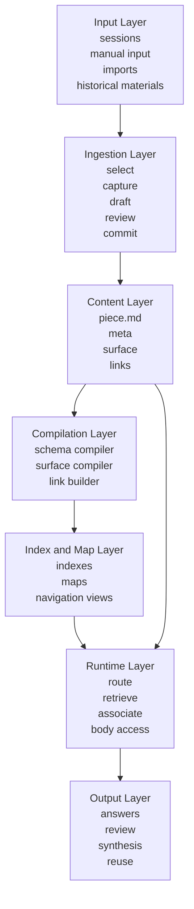
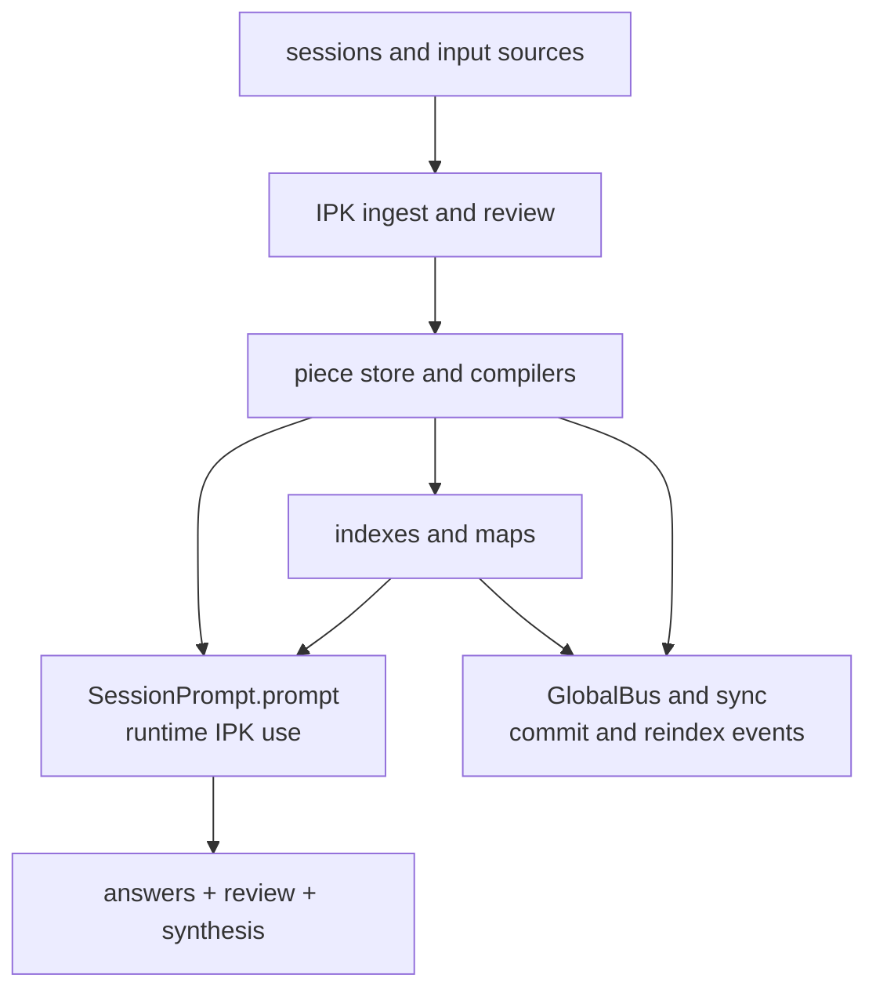
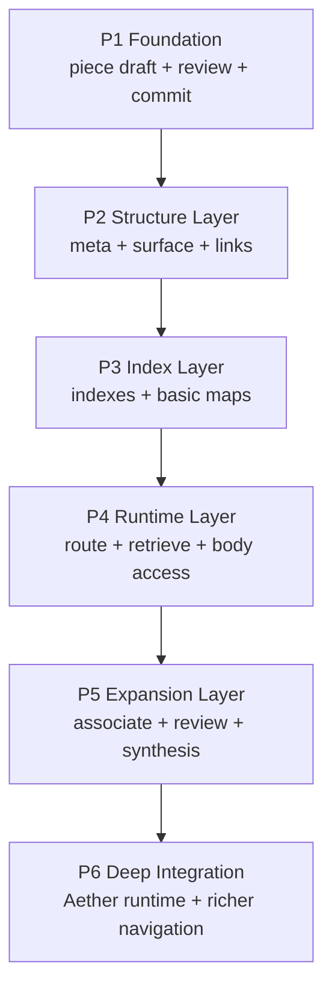

# IPK Content System Overview

## One-line Definition

The `IPK` content system is not a normal notes library, and it is not simply "putting materials into a knowledge base."

It is a long-term content system.  
Its purpose is to turn the ideas, knowledge, discussions, reflections, and project materials that arise during research, learning, and work into a foundation that can be preserved, organized, retrieved, reused, and further developed over time.

In other words, it is not about "storing more content."  
It is about making previously created content genuinely useful again in the future.

## What Problems It Solves

At a generalized level, IPK addresses several classes of problems:

### 1. Low-friction capture

Research and learning constantly generate:

- ideas
- questions
- intuitions
- local judgments
- half-finished derivations
- temporary summaries

These materials are often highly valuable but low in maturity.  
If they are not recorded, they disappear quickly.  
If every item must be polished into a full note, the cost becomes too high.

So the system needs:

- low-friction capture
- automatic organization
- user review focused on the true content layer

### 2. Long-term organization

Even when material is recorded, it often remains only a pile of disconnected notes.

The hard question is not "was this written down?"  
The hard question is:

- can it be found later
- can the system understand what kind of material it is
- can it see how it relates to other material
- can it place it inside a longer developmental structure

### 3. Large-scale runtime use

As the content library grows, the system cannot rely on:

- raw full-text search only
- always reading large bodies first
- blind searching across the entire library

That would lead to:

- high cost
- higher latency
- context overload
- unstable results

### 4. Reuse and development

A valuable long-term content system should not only support "looking things up again."  
It should also support:

- background use in explicit IPK flows and future runtime extensions
- historical path and question tracing in research and learning
- periodic review and reflection
- new synthesis and association across existing material

## Core Principles

### 1. The human owns content, the AI owns structure

This system follows a crucial principle:

> The user mainly provides the content worth preserving.  
> The AI turns that content into a structure that can be used over time.

The user should not have to hand-maintain:

- schemas
- indexes
- retrieval surfaces
- link extraction
- map compilation

### 2. `piece` must be the unified minimum unit

The system should not be built around many incompatible object types.

The current most coherent choice is:

- use `piece` as the unified minimum cognitive unit

That lets the system consistently carry:

- ideas
- knowledge
- threads
- reviews
- plans
- project-related fragments

while keeping the overall structure expandable.

### 3. Maps guide, surface judges, body confirms

This principle is fundamental.

- maps are routing priors, not answer summaries
- surface is the AI work layer, not a body replacement
- the body remains the true content and evidence layer

If these layers collapse into one another, the system becomes:

- less stable
- harder to scale
- more expensive to use
- less accurate at judging relevance

### 4. Long-term direction: how ordinary Q&A may connect to IPK

IPK should not remain useful only when the user explicitly opens the library.

But this is a long-term direction, not the first-pass default behavior.

The more coherent long-term target is:

- the user asks a normal question
- the system decides in a future extension whether IPK is relevant
- it routes through maps and surfaces first
- then decides whether to drill into the body

In the first pass, IPK is still used only when the user explicitly asks for it.

## What Capabilities It Should Eventually Provide

Viewed as a capability system, IPK should reliably support the following:

### 1. Content capture

It should be able to generate content drafts from multiple kinds of input, such as:

- sessions
- message selections
- manual text input
- imported material

Then it should automatically generate:

- title
- body summary
- body draft
- structural fields
- surface
- links

### 2. Content structuring

The system should not store body text alone.  
It should also maintain:

- stable structural fields
- AI work surfaces
- content relations
- status and origin

so that content becomes a reusable long-term object rather than a single raw document.

### 3. Multi-layer routing and retrieval

The system should be able to:

- locate candidate regions through maps and navigation
- judge relevance through surface
- read the body only when needed

So the primary pipeline is no longer:

- keyword hit -> read full text

but rather:

- map entry -> candidate surfaces -> focused drill-down -> body confirmation

### 4. Precision and association together

A research-oriented content system needs both:

- precise retrieval of strong evidence

and:

- method transfer, problem-shape similarity, and cross-topic association

So it must support both:

- precision-oriented retrieval
- association-oriented expansion

### 5. Long-term review and synthesis

The system should support more than finding one item.  
It should also support:

- reviewing what happened over a period of time
- reconstructing the path of a project
- finding repeatedly returning questions
- synthesizing a set of related pieces into something new

## Key Objects

The key IPK objects and file layers can be summarized like this:

- `piece`
  the unified minimum unit

- `piece.md`
  the body and truth layer

- `meta.json`
  the stable structural layer

- `surface.json`
  the AI work layer

- `links.json`
  the structured relation layer

- maps
  the precompiled routing-entry layer

- indexes
  the internal index layer that supports filtering, retrieval, and navigation

Inside `surface.json`, the current three most important layers are:

- `catalog`
  for lightweight filtering and map compilation

- `retrieve`
  for accurate relevance judgment and deeper reading decisions

- `associate`
  for weak association, analogy, and transfer

## High-level Implementation Architecture

If this system is presented as a mature solution, it should be presented as a set of cooperating modules, not only as a vision statement.

### 1. Input layer

The system should support multiple sources of content rather than tie itself to one input form.

### 2. Ingestion layer

This layer turns raw material into a reviewable, committable piece draft.

The currently recommended workflow is:

- `select`
- `capture`
- `draft`
- `structure`
- `quality`
- `review`
- `commit`
- `reindex`

### 3. Content layer

This is the canonical long-term source layer.

It includes at minimum:

- `piece.md`
- `meta.json`
- `surface.json`
- `links.json`

### 4. Compilation layer

This layer generates machine-usable structure from the body and surrounding context.

It includes at minimum:

- schema compiler
- surface compiler
- link builder
- quality rewrite

### 5. Index and map layer

This layer is what makes large-scale navigation possible at runtime.

It includes at minimum:

- foundational indexes
- map compilation
- multi-layer navigation views

### 6. Runtime layer

This is the layer that most directly affects explicit IPK use, future ordinary-Q&A extension, and research reuse.

It is responsible for:

- routing into the right map
- candidate filtering
- precise retrieval
- weak-association expansion
- body reading when necessary

## How It Fits Into Aether

From the current Aether architecture, the high-level landing points of IPK can be summarized like this:

The most important module groups are:

- `ipk/ingest`
  capture, draft, review, and commit flow

- `ipk/piece`
  canonical piece objects

- `ipk/schema`
  structural field generation

- `ipk/surface`
  AI work-surface compilation

- `ipk/link`
  relation construction and updates

- `ipk/map`
  map and navigation-view compilation

- `ipk/search`
  runtime route, retrieve, and associate logic

## Relationship to the User Adaptation System

IPK and the user adaptation system are designed to cooperate closely, but they have different responsibilities.

### IPK is responsible for:

- what content exists
- how content connects to other content
- how content is found, verified, and reused

### The user adaptation system is responsible for:

- how the AI should understand the user
- how the AI should understand the task and artifact
- how answers and actions should be organized

So the relationship is:

- IPK provides reusable long-term content
- adaptation determines how that content should be used for this user and this task

## Recommended Implementation Order

This system is no longer only a wish list.  
It can be implemented in clear stages.

### Phase 1

- piece draft
- user review
- commit

Stabilize low-friction capture and durable commit first.

### Phase 2

- `meta.json`
- `surface.json`
- `links.json`

Turn a piece from a raw body into a structured object.

### Phase 3

- foundational indexes
- foundational maps
- multi-dimensional entry views

Solve the large-scale navigation problem.

### Phase 4

- runtime route
- retrieve
- body access

Prepare the runtime base for future ordinary-Q&A connection to IPK.

### Phase 5

- associate
- review
- synthesis

Support stronger association, review, and long-range synthesis.

### Phase 6

- deeper Aether runtime coupling
- richer navigation and triggers
- stronger reuse loop

## Final Summary

If I had to explain this project in one paragraph, I would say:

> We are not designing a new note feature.  
> We are designing a long-term content system.  
> It turns the ideas, knowledge, discussions, and reflections produced during research, learning, and work into a reusable piece library,  
> and uses surfaces, links, maps, and runtime routing so that those materials can continue to be retrieved, reused, and developed in the future.
