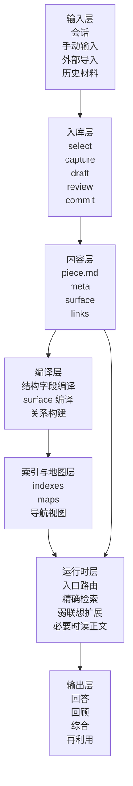
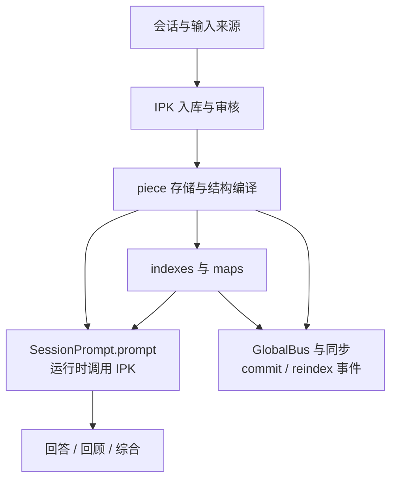
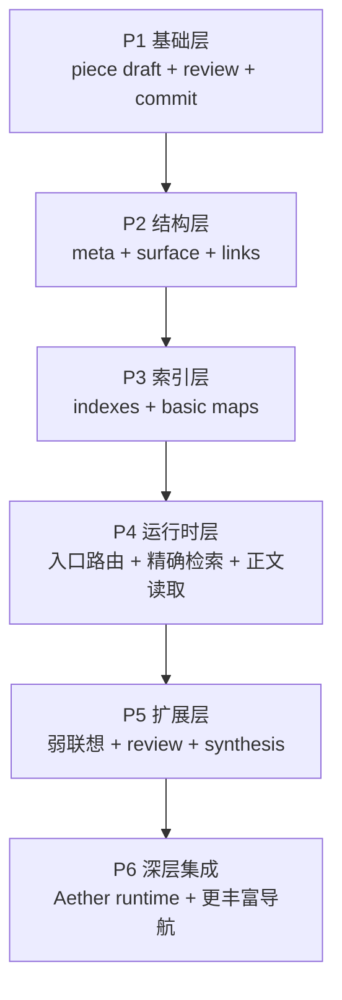

# IPK 内容系统总览

## 一句话定义

`IPK` 内容系统不是一个普通笔记库，也不是“把材料都塞进知识库里”。

它是一套长期内容系统。  
它的目标是把研究、学习和工作过程中不断出现的想法、知识、讨论、反思和项目材料，整理成一个可以被长期保存、持续组织、再次检索、重新调用和继续发展的内容底座。

换句话说，它关心的不是“多存一点内容”，而是“让已经产生过的内容在未来还能真正发挥作用”。

## 阅读提示

如果第一次阅读本页时遇到下面这些词不太确定是什么意思：

- `piece`
- `surface`
- `catalog`
- `retrieve`
- `associate`
- `links`
- `maps`
- `route`
- `synthesis`

建议先配合阅读：

- [ipk-terms-glossary.zh-CN.md](/home/bzz/Aether/docs/IPK/ipk-terms-glossary.zh-CN.md)
  统一术语表
- [ipk-content-system-piece-and-map-explainer.zh-CN.md](/home/bzz/Aether/docs/IPK/01-ipk-content-system/ipk-content-system-piece-and-map-explainer.zh-CN.md)
  `piece` 与 `map` 的集中说明

本页里最核心的几个词，可以先这样抓：

- `piece`
  `IPK` 里的统一最小长期内容对象。它不是一条原始消息，也不是临时检索出来的一段文本，而是一条已经被整理过、可以长期保存、长期引用、长期被 AI 再次使用的内容对象。
- `surface`
  `piece` 暴露给 AI 的结构化工作面。它不是普通摘要，而是让 AI 在不先读全文的情况下，也能判断这条内容大概讲什么、是否强相关、值不值得继续深入。
- `links`
  `piece` 和其他 `piece` 之间的结构化关系边。它们不只是“打标签”，而是要明确表达两条内容之间是什么关系、为什么相关。
- `map`
  从大量 `piece` 上方编译出的导航层。它不直接给答案，而是告诉系统面对很多内容时应该先去哪个区域看。
- `retrieve`
  一种“精确判断强相关”的工作面或阶段。它的任务不是自由发散，而是判断这条内容是不是当前问题真正需要的命中对象。
- `associate`
  一种“弱联想与迁移扩展”的工作面或阶段。它不负责给出强证据，而负责提供类比、桥接和启发。

后面还会出现下面这些文件名：

- `meta.json`
  `piece` 的结构身份证，保存这条内容“是谁、从哪里来、属于什么类型、当前成熟到哪一步”。
- `surface.json`
  `piece` 面向 AI 的工作面文件，里面会细分不同层级的判断信息。
- `links.json`
  `piece` 的关系文件，保存它和其他内容的显式关系。

## 这套系统要解决什么问题

如果把需求抽象开，IPK 主要是在解决下面几类问题：

### 1. 低成本捕捉问题

研究和学习中会不断产生：

- 想法
- 问题
- 直觉
- 局部判断
- 半成品推导
- 阶段性总结

这些内容通常价值很高，但成熟度很低。  
如果不记录，很快会丢；如果要求每次都写成长文，成本又太高。

所以系统需要支持：

- 低成本捕捉
- 自动整理
- 用户只审核真正重要的内容层

### 2. 长期组织问题

即使内容被记下来了，它们也经常只是“堆在一起”，而没有形成长期结构。

真正困难的不是“有没有记录过”，而是：

- 之后还能不能找到
- 能不能知道它属于哪类材料
- 能不能知道它和哪些内容相关
- 能不能知道它在长期演化中处于什么位置

### 3. 大规模调用问题

当内容量逐渐变大后，系统不能每次都：

- 直接全文检索
- 让 AI 读大量原文
- 在整个库里盲目搜索

否则会：

- 成本高
- 速度慢
- 上下文爆炸
- 结果不稳定

### 4. 再利用问题

真正有价值的长期内容系统，不只是能“回看”，还应该能：

- 在显式 `IPK` 调用与未来运行时扩展中作为背景知识被调用
- 在研究和学习中提供历史路径与问题线索
- 在回顾和复盘中帮助总结阶段变化
- 在联想与综合时提供新的连接

## 核心原则

### 1. 人负责内容，AI 负责结构

这套系统坚持一个非常重要的原则：

> 用户主要负责表达真正想保留的内容。  
> AI 负责把这些内容整理成可长期使用的结构。

用户不应该被迫手工维护：

- schema
  也就是对象的字段结构、文件格式和生成约束。
- 索引
  也就是为了让系统以后能更快找到内容，而预先整理出来的入口视图。
- 检索暴露层
  也就是专门暴露给 AI 做筛选、判断和联想的结构化工作面。
- `links` 抽取
  也就是自动判断一条内容和哪些其他内容有关、是什么关系、为什么相关。
- 地图编译
  也就是把大量内容预先整理成可导航入口，而不是每次都现扫全库。

### 2. `piece` 必须作为统一最小单元

系统最终不应该围绕许多互不兼容的小对象来构建。

当前最推荐的方式是：

- 用 `piece` 作为统一最小认知单元

这里的 `piece` 不是一句简短标签，也不是一段原始对话切片。

它更像是系统里的标准内容对象：

- 一条内容一旦进入 `IPK`
- 就会以一个 `piece` 的形式被保存
- 并同时带有正文、结构字段、AI 工作面和关系信息

这样系统以后查找、判断、联想和复盘时，用的就不是一堆零散原材料，而是一组稳定对象。

这样它既可以承接：

- idea
- knowledge
- thread
- review
- plan
- 项目相关片段

也允许系统在不破坏整体结构的情况下继续扩展。

### 3. 地图负责引路，surface 负责判断，正文负责证实

这条原则非常关键。

- 地图不是答案摘要，而是位于大量 `piece` 上方的导航层，负责告诉系统“先去哪个区域看”
- `surface` 不是正文替代，而是 `piece` 暴露给 AI 的结构化工作面，负责让 AI 先判断“这条内容值不值得继续深入”
- 正文才是真正的内容与证据层

如果这三者混在一起，系统就会变得：

- 不稳定
- 难扩展
- 检索成本高
- 判断精度差

### 4. 长期方向：普通问答如何接入 IPK

`IPK` 不应永远停留在“只有用户主动进入库里浏览时才有用”的状态。

但这部分属于长期方向，不是第一版默认行为。

更合理的长期目标是：

- 用户正常提问
- 系统在未来扩展里判断是否需要查 `IPK`
- 先走地图和 `surface`
- 再决定是否下钻正文

第一版仍然只在用户明确要求调用 `IPK` 时使用它。

## 这套系统最终应该具备什么能力

从能力视角看，这套系统最终应稳定支持下面几类能力：

### 1. 内容捕捉

系统应能够从多种原始输入中生成内容草稿，例如：

- 会话
- 消息片段
- 手动输入
- 外部导入材料

然后自动生成：

- 标题
- 正文摘要
- 正文草稿
- 结构字段
  例如 `id`、`type`、`status`、`domains`、`methods`、`projects` 这类稳定信息
- `surface`
  也就是给 AI 用来做筛选、精确判断和联想扩展的工作面
- `links`
  也就是这条内容和其他内容之间的显式关系

### 2. 内容结构化

系统不只是保存正文，还会同时维护：

- 稳定结构字段
- AI 工作面
- 内容关系
- 状态与来源

从而让内容不是“单一文本”，而是“可被机器稳定使用的长期对象”。

### 3. 多层路由与检索

系统应能够：

- 先通过地图和导航找到候选区域
- 再通过 surface 判断相关性
- 最后在必要时才读取正文

这意味着检索主链路不再是：

- 关键词命中 -> 直接读全文

而是：

- 地图入口 -> 候选 surface -> 局部下钻 -> 正文证实

### 4. 精确检索与弱联想并存

研究型内容系统既需要：

- 找到强相关证据

也需要：

- 保留方法迁移、问题相似性、跨主题连接等弱联想能力

所以系统必须同时支持：

- 精确检索
  也就是优先找强相关、可以直接支撑当前问题的内容
- 弱联想扩展
  也就是从方法相似、问题相似、解释框架相似的内容中找启发

### 5. 长期回顾与综合

系统最终应支持的不只是“查某一条内容”，还包括：

- 回顾某段时间做了什么
- 梳理某个项目走过的路径
- 归纳反复出现的问题
- 综合一组相关 piece 形成新的总结

## 关键对象

IPK 的关键对象和文件层次可以概括成下面这一组：

- `piece`
  统一最小单元。它代表一条已经进入长期层、可以被再次调用的标准内容对象，而不是原始消息本身。

- `piece.md`
  正文与内容真相层。真正想长期保留的想法、讨论整理、推导、判断、反思和补充都落在这里。

- `meta.json`
  稳定结构字段层。它不保存正文细节，而是保存这条 `piece` 的身份信息，例如它是什么类型、来自哪里、当前成熟到哪一步、属于什么项目或领域。

- `surface.json`
  面向 AI 的工作面。它不是一段普通摘要，而是专门为 AI 运行时使用而准备的结构化暴露层。

- `links.json`
  结构化关系层。它保存这条 `piece` 和其他 `piece` 的显式关系边，例如支持、延伸、矛盾、共享方法等。

- maps
  预先编译的路由入口层。它把大量 `piece` 重新组织成“先去哪看”的导航入口，而不是让系统每次都全库盲搜。

- indexes
  支撑检索、过滤和导航的内部索引层。它们通常比地图更底层，更像各种可重排、可聚合、可过滤的结构化视图。

其中 `surface.json` 当前最关键的三层是：

- `catalog`
  用于轻量筛选和地图编译。它最短、最稳，负责告诉系统这条 `piece` 大致属于哪个方向、是否值得先放进候选区。

- `retrieve`
  用于准确判断相关性与是否继续深入。它主要回答“这条内容到底是不是当前问题要找的强相关对象”。

- `associate`
  用于弱联想、类比和迁移扩展。它不负责给出强证据，而负责告诉系统“这条内容会不会对另一个问题带来启发”。

## 高层实现架构

如果把它当成一个成熟方案来讲，最重要的是把它讲成一组明确协作的模块，而不是只讲愿景。

### 1. 输入层

系统应支持多种内容来源，而不把内容入口限制为某一种交互形式。

### 2. 入库层

这层负责把原始内容整理成可审核、可提交的 piece 草稿。

当前最推荐的工作流是：

- `select`
  先决定哪些原始输入值得进入 `IPK`，而不是把所有内容都无差别入库。
- `capture`
  提取原始内容和来源上下文，为后续结构化做准备。
- `draft`
  生成标题、正文简介和正文草稿。
- `structure`
  生成 `meta`、`surface` 和 `links` 这几类结构层文件。
- `quality`
  对关键字段做一轮质量重写，避免生成结果太空、太泛或太不稳定。
- `review`
  让用户主要审核标题、正文简介和正文有没有表达对。
- `commit`
  把这条内容正式写入长期存储。
- `reindex`
  更新索引和地图，让新内容进入后续可检索状态。

### 3. 内容层

这是长期真源层。

它至少包括：

- `piece.md`
- `meta.json`
- `surface.json`
- `links.json`

### 4. 编译层

这层负责从正文与上下文生成结构化工作面。

它至少包括：

- schema compiler
  负责把正文和来源信息编译成稳定结构字段。
- surface compiler
  负责把正文编译成给 AI 使用的 `catalog`、`retrieve`、`associate` 工作面。
- link builder
  负责为一条 `piece` 构建与其他 `piece` 的显式关系边。
- quality rewrite
  负责对关键字段做二次重写和质量修正。

### 5. 索引与地图层

这层负责让大规模库在运行时仍然可导航、可路由。

它至少包括：

- 基础索引
- 地图编译
- 多层导航视图

### 6. 运行时层

真正影响显式 `IPK` 调用，以及未来普通问答扩展的，是这层。

它至少负责：

- 路由到合适地图
  也就是决定这次问题更适合先从哪类入口进入。
- 候选筛选
  也就是先把注意力压缩到少量区域或少量对象。
- 精确检索
  也就是用 `retrieve` 层判断哪些内容是真正强相关的命中对象。
- 弱联想扩展
  也就是用 `associate` 层和关系边做受控扩展。
- 必要时读取正文
  也就是只有在表层判断仍不够时，才继续进入 `piece.md` 读取细节与证据。

## 在 Aether 中的落点

从当前 Aether 架构出发，IPK 的高层落点可以概括成：

对应到工程模块，当前最重要的模块包括：

- `ipk/ingest`
  负责捕捉、草稿、审核与入库链路

- `ipk/piece`
  负责 piece 真源对象

- `ipk/schema`
  负责结构字段与 schema 生成，也就是把一条内容稳定地整理成系统能理解的对象格式。

- `ipk/surface`
  负责 AI 工作面编译，也就是把正文改写成适合筛选、精确判断和联想扩展的结构化表层。

- `ipk/link`
  负责关系构建与更新，也就是自动维护 piece 之间“为什么有关”的显式关系边。

- `ipk/map`
  负责地图与导航视图编译，也就是把大量内容重新组织成可导航入口。

- `ipk/search`
  负责 `route` / `retrieve` / `associate` 运行时逻辑，也就是先选图、再收缩候选、再按需要做弱联想的主链路。

## 和用户自适应系统的关系

IPK 和用户自适应系统会长期协作，但职责不同。

### IPK 负责：

- 存什么内容
- 内容之间怎么连
- 内容怎样被查找、验证和复用

### 用户自适应系统负责：

- 怎样理解用户
- 怎样理解任务和产物
- 怎样更合适地组织回答与执行

可以把它们的关系概括成：

- IPK 提供“可被使用的长期内容”
- adaptation 提供“怎样更合适地使用这些内容”，也就是用户自适应系统负责决定未来更适合怎样解释、怎样执行。

## 建议的实现顺序

这套系统已经不是只有理想目标的早期草案。  
它完全可以按清晰阶段推进实现。

### Phase 1

- piece draft
- 用户审核
- commit

先把“低成本捕捉并稳定入库”做稳。

### Phase 2

- `meta.json`
- `surface.json`
- `links.json`

把 piece 从单一正文提升成结构化对象。

### Phase 3

- 基础 indexes
- 基础 maps
- 多维入口

解决“大规模内容如何导航”的问题。

### Phase 4

- runtime route
  也就是为未来普通问答接入 `IPK` 准备选入口、选区域的能力。
- retrieve
  也就是让系统稳定判断哪些内容是真正强相关命中。
- body access
  也就是必要时继续读正文，而不是永远停在摘要层。

为未来普通问答稳定调用 `IPK` 准备运行时基础。

### Phase 5

- associate
  也就是开始支持更有生命力的弱联想、类比和迁移扩展。
- review
  也就是开始支持更系统的阶段复盘和内容回看。
- synthesis
  也就是把多条相关内容综合成新的总结、综述或新对象。

开始支持更强的联想、回顾和综合能力。

### Phase 6

- 与 Aether runtime 深层联动
- 更丰富的导航和触发
- 更稳定的调用闭环

## 总结

如果要用一句最适合对外展示的话来概括它，我会这样说：

> 我们在做的不是一个新的笔记功能，而是一个长期内容系统。  
> 它把研究、学习和工作过程中产生的想法、知识、讨论和反思整理成可再次调用的 piece 库，  
> 并通过 surface、links、地图和运行时路由，让这些内容在未来继续被检索、复用和发展。
