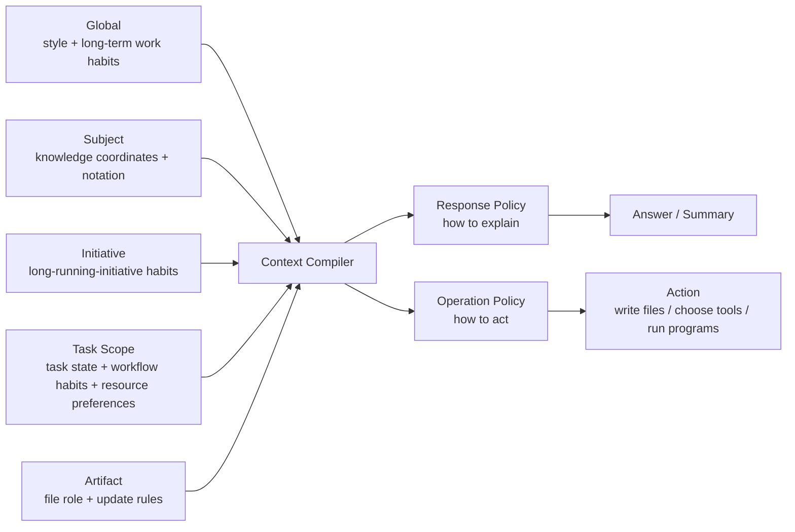

# User Adaptation System Details

## 1. Purpose of This Document

This file is not the presentation version.  
It is the detailed reference.

Its purpose is to make the following things explicit:

- what problem this system is actually solving
- where the system boundary is
- what the core principles are
- what each scope is responsible for
- how records are stored, updated, and used
- how the design should fit into Aether

If someone asks:

- why do we need `global / subject / task_scope / artifact`
- why do we need `proposal`
- why is a knowledge base not enough
- why should records be local-first
- how this differs from Aether's existing `workspace` or `worktree`

this document should answer those questions.

## 2. The Current System Definition

The name "user adaptation system" is still useful, but the actual design is now larger than a simple style-profile feature.

It is now better described as:

- an AI-maintained long-term context system
- a local-first private record system
- a scope-aware understanding system
- a context compilation system used before future answers and actions
- a system that gradually learns how the user works, records, and operates resources

So the core object set is no longer just:

- `signals`
- `summaries`
- `profile`
- `policy`

It now also needs:

- `proposal`
- `subject_profile`
- `task_scope`
- `artifact_contract`
- `context_packet`

## 3. System Boundary

### 3.1 What this system should record

It should record information that matters to the question:

- how should the AI help this person
- how should the AI help this task

That includes:

- global style and interaction tendencies
- subject-specific knowledge coordinates and notation preferences
- longer-term work habits such as ordering, recording, calculation, and setup tendencies
- the current goal and state of a task
- task-specific workflow habits such as maintaining paired `overview + details` record files
- the output constraints, update triggers, and write rules of a concrete artifact
- which folder, program, skill, script, or procedure is preferred in which situation
- the evidence, summaries, and candidate conclusions used to maintain those records

### 3.2 What this system should not directly store

It should not be the primary home for:

- raw knowledge content itself
- the body of a paper or book
- the full body of a derivation
- the content already managed as `piece` objects in the IPK content system

Those remain the responsibility of the content system.

## 4. Core Principles

### 4.1 The user decides habit boundaries; the AI handles low-level organization

This is one of the most important decisions in the whole design.

The user should mainly do:

- ask questions
- provide materials
- make domain judgments
- correct the AI
- confirm whether important summaries are accurate
- decide which habits are worth fixing
- decide where a habit should apply
- decide whether a habit should be promoted, narrowed, disabled, or rewritten

The user should not be expected to do:

- design the internal schema
- choose retrieval structures
- tune embeddings
- decide how context should be compiled for future AI calls

### 4.2 The AI should own internal representation and retrieval

The system should assume:

- the AI is in a better position to decide what kind of representation helps future AI read and use records well

That means:

- the implementation may use JSON, Markdown, indexes, summaries, caches, or combinations of them
- but that should primarily be a system design decision, not a user burden

### 4.3 Local-first by default

This system will contain highly sensitive information:

- weak areas
- long-term working habits
- project state
- writing constraints
- artifact paths

So the recommended default is:

- local-only storage
- no default cloud sync
- project reference-layer records in the independent memory root's `projects/` partition
- global truth-source records in the independent memory root's `global/` partition
- subject truth-source records in the independent memory root's `subjects/` partition
- `task_scope` / `artifact` truth-source records in the independent memory root's `task-scopes/` and `artifacts/` partitions
- no default long-term adaptation source of truth inside project directories in v1

### 4.4 Slow updates, not no updates

The system cannot be over-sensitive, but it also cannot remain static.

So the recommended approach is:

- local evidence may be recorded quickly
- summaries are produced on windows
- high-impact conclusions first become `proposal`
- stable long-term layers update only after sufficient evidence or confirmation

### 4.5 High-impact understanding should be confirmed

Some inferred conclusions can materially change future work quality.

Examples:

- "The user wants to focus on physics content and does not want to manage AI internals."
- "This task should emphasize rigorous derivation, not exploratory brainstorming."
- "Course summaries should be written into `notes/main.tex` by default."

These should not silently become permanent policy.  
The better path is:

- AI infers the candidate conclusion
- creates a `proposal`
- merges similar proposals and places them in a pending review queue
- asks the user to review them in batches at an appropriate moment
- only then promotes it into stable records

### 4.6 The system must adapt execution, not only explanation

This system should no longer solve only:

- how should the AI explain to this user

It should also solve:

- how should the AI work more like this user
- when should record files be updated
- which tool should be preferred when several equivalent options exist
- how a preferred program or workflow should be operated

So the system now supports two broad classes of tasks:

- response tasks
- execution tasks

The first cares about explanation quality.  
The second cares about workflow consistency and operational style.

## 5. The Scope Model

The recommended **habit-library scope model** is the **five parallel scopes** (see [user-adaptation-system-top-level-constraint.zh-CN.md](/home/bzz/Aether/docs/IPK/02-user-adaptation-system/user-adaptation-system-top-level-constraint.zh-CN.md)):

```text
global
subject
initiative
task_scope
artifact
```

These five scopes are **parallel** labels — not a tree and not an ownership hierarchy. They only describe where a habit might be worth referencing.

`session` is **not** a library scope; it is the runtime layer and is covered separately at the end of this section.

### 5.1 `global`

`global` stores long-term user-wide tendencies.

Examples:

- prefers more rigor or more intuition
- prefers more caution or more exploration
- prefers to start from known knowledge
- long-term tendencies around length, abstraction, and boundary conditions
- long-term tendencies around work order, recording density, and organization rhythm

This layer should update the slowest.

### 5.2 `subject`

`subject` stores knowledge coordinates inside a specific subject or topic.

Examples:

- known anchors
- preferred formal language
- preferred notation
- fragile zones
- explanation preferences that apply in this subject

This layer solves the problem:

- the AI does not know how far the user already is in this subject
- the AI switches into a foreign formalism and makes a familiar problem feel unfamiliar

### 5.3 `initiative`

`initiative` stores habits that are stable across many tasks inside one real long-running initiative.

It is one of the five library scopes — it is **not** the Aether workspace `project`. v1 does not bind `project` to `initiative` by default: one project may serve multiple initiatives, and multiple projects may serve one initiative.

Typical content:

- the goal of the initiative
- work rules that hold across many of its tasks
- default resource preferences and record-file role splits within the initiative
- long-term decisions scoped to the initiative (not to a single task)

`initiative` closes the gap where `task_scope` is too narrow and `subject` is too broad.

### 5.4 `task_scope`

`task_scope` stores the long-running context of a concrete logical task.

It is not equal to a single session, a repo, or Aether's existing worktree concept.

It represents:

- one thing the user is actively trying to do over time

Examples:

- studying a course over weeks
- drafting a paper over many sessions
- developing a line of research discussion
- maintaining a structured notes workflow

It should record:

- goal
- current status
- what is done
- important decisions
- current priorities
- open questions
- related subjects
- related IPK pieces
- workflow habits
- record-file role split
- resource preferences and procedures
- active artifacts

### 5.5 `artifact`

`artifact` stores constraints that belong to a concrete output target.

Examples:

- a LaTeX file
- a paper draft
- a course notes file
- a template-driven summary document

It should record:

- file path
- file role, such as `overview`, `details`, or `notes`
- format
- write mode
- insertion anchors
- update triggers
- whether it is paired or bundled with other artifacts
- style priorities
- required macros or structures
- protected regions

### 5.6 `session` is not a library scope

`session` belongs to the runtime layer and is **not** one of the five library scopes.

It carries:

- temporary requests explicitly stated in this session (part of scratch habits)
- references fetched from the five library scopes via scope matching
- both streams run **in parallel** to form the runtime-active set

`session` may override higher layers for the current turn, but it does not automatically rewrite library truth. Anything from the session layer must go through proposal → confirmed before entering any of the five library scopes.

### 5.7 Scope precedence

The recommended precedence at compile time is:

```text
session runtime (current user instruction + scratch habits)
  > artifact
  > task_scope
  > initiative
  > subject
  > global
```



## 6. Core Objects

This section explains the core objects in the user adaptation system and their roles in the chain from evidence, to candidate conclusions, to confirmed long-term records, to query-time context packets.

## 6.1 `signals`

`signals` are the smallest evidence units.

They represent:

- something locally observed in one session

They can cover:

- response-style evidence
- knowledge-anchor evidence
- notation-preference evidence
- task-principle evidence
- artifact-constraint evidence

Current v1 constraint:

- automatic extraction on the fast path currently reads only the user messages from the current session; assistant text can help interpret context but is not itself habit evidence
- file changes, tool operations, and broader evidence sources are deferred to later versions

Example:

```json
{
  "id": "sig_20260407_001",
  "session_id": "ses_xxx",
  "scope": {
    "level": "subject",
    "target": "statistical-mechanics"
  },
  "kind": "prefers_rg_language",
  "confidence": 0.78,
  "evidence": [
    {
      "source": "user_message",
      "ref": "msg_123",
      "quote": "Please use the statistical mechanics language I already know."
    }
  ],
  "note": "The user again requested a familiar language before abstraction."
}
```

## 6.2 `summaries`

`summaries` are intermediate periodic compressions of many signals.

They are meant to:

- reveal trends
- support later profile or policy updates
- serve as a readable middle layer

They are not permanent truth.

## 6.3 `proposals`

`proposals` are one of the most important additions in the new design.

They represent:

- a high-impact candidate conclusion inferred from evidence
- which should often be confirmed before it becomes stable policy
- a pending item that may be merged with similar proposals before user review

Good use cases:

- core working principles
- writing priorities
- important task constraints
- default output conventions

Example:

```json
{
  "id": "prop_20260407_001",
  "scope": {
    "level": "task_scope",
    "target": "scope_statmech_course_2026"
  },
  "kind": "task_principle",
  "merge_key": "task_scope:scope_statmech_course_2026:task_principle:ai_handles_record_structure",
  "summary": "The user wants to focus on physics content while the AI handles storage, retrieval, and internal structure.",
  "impact": "high",
  "confidence": 0.83,
  "evidence_refs": ["sig_20260407_010", "sig_20260407_014"],
  "merged_from": ["prop_20260407_000"],
  "status": "pending"
}
```

Recommended statuses:

- `pending`
- `deferred`
- `confirmed`
- `rejected`

The first version should not immediately pop up every proposal or write it into stable records as soon as it appears.

The safer flow is:

```text
candidate proposal
  -> merge / deduplicate
  -> pending review queue
  -> user batch review
  -> confirmed / rejected / deferred
```

## 6.3a Promotion Channel

The promotion channel solves one central issue: user habits are usually first observed inside a single session, but valuable long-term habits may need to guide a `task_scope`, `initiative`, `subject`, or even the global layer. A separate `workflow_profile` would be vNext, not part of the current formal scope set.

The recommended term is `scope promotion`.

The first-version chain is:

```text
session evidence
  -> signal
  -> session / task summary
  -> promotion candidate
  -> merged proposal
  -> user batch review
  -> confirmed higher-scope profile / policy
```

Layer responsibilities:

- session evidence only records what happened in one conversation or action frame
- signal is the smallest evidence unit and may be generated automatically, but should not directly change broad long-term behavior
- summary compresses multiple signals inside the same scope and helps judge whether a trend is stable
- promotion candidate means the system thinks a trend may belong in a broader or more stable scope
- proposal sends high-impact or broader-scope promotion to user review
- confirmed higher-scope records are the only records that should guide more future sessions or projects

First-version human / AI split:

- AI may decide low-impact, local, reversible records such as session signals, task summaries, context-packet caches, and evidence / confidence updates for already confirmed habits.
- AI should ask the user about medium-confidence or high-confidence candidates whose target scope is unclear, such as whether a task habit should become initiative policy.
- The user must decide high-impact promotions such as `global_guidance` writes, broader workflow-style rules, file-write rules, tool choices, automatic coupling, and default workflows.

Therefore the first version may let AI discover promotion candidates automatically, but it must not silently promote a session habit into an `initiative`, `subject`, or `global` habit.

The long-term truth source of the adaptation system should be treated as an independent habit library. The `global / subject / initiative / task_scope / artifact` layers inside that library are parallel scope labels, not a tree of ownership. On the Aether workspace side, `global_guidance`, `project_guidance`, and `session binding` form the workspace reference layer into the library. The runtime-active set should be understood as `imported active habits + scratch active habits`: the imported branch enters through the session binding's `habit_ids`, while the scratch branch comes from the current session scratch area. `global_guidance` and `project_guidance` mainly provide subject-blocked reference material for session matching. These workspace records should store lightweight background plus refs, not copied habit bodies as a second truth source.

At runtime, `initiative_id / task_scope_id / subject_ids / artifact_ids` inside `session binding` should be read as the current mounted state of the session, not as a candidate pool and not as a historical accumulation bag.

This distinction matters:

- `scope matching`
  deciding which layers are relevant to the current request, signal, or context packet
- `scope read`
  reading a small number of relevant records and compiling them into runtime context
- `scope promotion`
  writing a lower-scope habit into a broader layer so it affects a wider future range

The first two should usually be automatic, with user confirmation only when confidence is low or conflicts exist. The third requires proposal confirmation when it broadens long-term impact or changes default future behavior.

When the user explicitly asks to organize habits or says a rule should apply in the future, the system may actively create a promotion proposal, but it should still show the evidence, source scope, target scope, target object, and future impact.

## 6.4 `profile`

`guidance`, `profile`, and `policy` should no longer be treated as one flat class of objects.

At minimum, the system should distinguish:

- workspace guidance objects
  - `global_guidance`
  - `project_guidance`
- library-internal profile objects
  - `subject_profile`
  - `initiative_profile`

### `global_guidance`

Stores workspace-global lightweight background plus refs, so query-time session retrieval can narrow the candidate habit range across projects and tasks.

Runtime now first trusts explicit binding / matcher results, then falls back to `project_guidance + global_guidance` together as lightweight guidance when the signal is still sparse.

### `subject_profile`

Stores knowledge coordinates inside one subject.

### `project_guidance`

Stores stable project background, cross-task constraints, and references to subjects, task scopes, artifacts, and IPK pieces.

`project_guidance` does not store project body content and does not replace artifacts, task scopes, or IPK pieces.

Here `project_guidance` belongs to the Aether workspace reference layer. The corresponding long-running scope label inside the habit library is `initiative`. Initiative membership is **not** derived from the current Aether project / worktree / repo / session binding; it is decided by the v1 routing classifier at proposal-confirm time.

**v1 establishes no default Aether-project-to-initiative binding** (see [docs/decisions/project-initiative-decoupling-and-routing.md](../../decisions/project-initiative-decoupling-and-routing.md)). Creating or opening an Aether project does not auto-create an initiative; `initiative_id` may not be derived from `project_id`; Aether project / worktree may serve as a context signal for the classifier, but it is not an identity source for initiatives. A single Aether project may reference multiple initiatives and a single initiative may be referenced by sessions across multiple projects — all via classifier routing, not hard binding.

Recommended fields:

- `summary`
- `stable_context`
- `subject_ids`
- `task_scope_refs`
- `artifact_refs`
- `ipk_piece_refs`

In plainer terms:

- `project_guidance` is not a pure index table, because a new session still needs a quick entry point into what this workspace is currently about.
- But it must not grow into a second content store; once a piece of information becomes long-form project content, long-term habit text, or reusable knowledge, it should move into task / artifact truth sources, the habit library, or IPK instead.

## 6.5 `policy`

`policy` still matters because:

- `profile` says what the system thinks the user or subject is like
- `policy` says what the system should do next

The best current interpretation is to split policy into:

- `response_policy`
  how to explain, where to start, how much rigor to use, and how to bridge into unfamiliar formalisms

- `operation_policy`
  how to act, what to do first, whether to update record files, which tool or path to prefer, and how to invoke those resources

Typical `operation_policy` concerns include:

- default work order
- record-file update rules
- how much calculation process to preserve before compression
- setup and directory-use habits
- tool, program, or skill preferences
- default procedures when multiple equivalent resources are available

But `policy` should also be scope-aware:

- global policy
- subject policy
- initiative policy
- task policy
- artifact contract

Long-term policy precedence is:

```text
artifact_contract
  > task_scope policy
  > initiative policy
  > subject policy
  > global policy
```

Adaptation policy must not override system / developer instructions, permission checks, explicit current-turn user instructions, or repo-level agent instructions such as `AGENTS.md`.

## 6.6 `task_scope`

`task_scope` is one of the most important new objects in the architecture.

Example:

```json
{
  "id": "scope_adaptation_docs_2026",
  "project_id": "proj_xxx",
  "title": "User Adaptation System Documentation Design",
  "kind": "design",
  "goal": "Continuously refine the user adaptation system docs while maintaining a presentation-facing overview and a queryable details document.",
  "active_subjects": ["user-adaptation-system", "aether-architecture"],
  "principles": [
    "The user decides habit scope and high-impact defaults; the AI handles lower-level organization, record-keeping, matching, and execution planning."
  ],
  "status_summary": "Currently expanding the system so it adapts not only explanation, but also work and operational habits.",
  "workflow_habits": {
    "recording_pattern": "maintain paired overview/details docs",
    "preferred_sequence": [
      "discuss",
      "extract_principles",
      "update_overview",
      "update_details"
    ],
    "calculation_style": "keep reasoning and constraints first, then compress into presentation-facing language",
    "setup_style": "prefer reusing existing project-local directories, skills, and programs"
  },
  "resource_preferences": [
    {
      "when": "updating record files",
      "prefer_roles": ["overview", "details"],
      "method": "update the overview first, then sync the details file"
    },
    {
      "when": "multiple equivalent tools are available",
      "prefer": "reuse existing project-local files, skills, and programs first",
      "reason": "reduce extra structure and migration cost"
    }
  ],
  "done": [
    "Completed one rewrite pass of the overview, details, schema, and integration docs."
  ],
  "decisions": [
    "Records should be local-first and private by default.",
    "Documentation records should keep an overview/details dual-file structure."
  ],
  "open_questions": [
    "How should operational habits and tool preferences be extracted and confirmed robustly."
  ],
  "linked_pieces": ["piece_20260407_001"],
  "artifacts": [
    "artifact_adaptation_overview_en",
    "artifact_adaptation_details_en"
  ],
  "confidence": 0.84
}
```

## 6.7 `artifact_contract`

`artifact_contract` governs how a concrete target artifact should be written.

Example:

```json
{
  "id": "artifact_adaptation_overview_en",
  "task_scope_id": "scope_adaptation_docs_2026",
  "role": "overview",
  "bundle_id": "adaptation_docs_en",
  "path": "docs/IPK/02-user-adaptation-system/user-adaptation-system-overview.en.md",
  "format": "markdown",
  "write_mode": "revise_in_place",
  "update_triggers": [
    "on_major_direction_change",
    "on_user_request_update_record_docs"
  ],
  "style_focus": [
    "vision",
    "motivation",
    "main_architecture",
    "roadmap"
  ],
  "partner_artifacts": [
    "artifact_adaptation_details_en"
  ],
  "protected_regions": [
    "# User Adaptation System Overview"
  ]
}
```

## 6.8 `context_packet`

`context_packet` is the compile-time result that actually gets injected into future model calls.

It does not have to be a long-term canonical record, but it is the object that most directly affects behavior.

First-version storage rule:

- the session db may store `context_packet_snapshot` for audit, debugging, and UI inspection
- the session db may store `context_packet_id` as a reference to one compiled result
- if the full context packet is persisted as a file, it should live under `MemoryPath.cacheRoot()/adaptation/context-packets/`
- cached context packets may be cleared or rebuilt, so they must not be the only long-term truth source for user habits

Example:

```json
{
  "request_id": "req_xxx",
  "session_id": "ses_xxx",
  "task_scope_id": "scope_adaptation_docs_2026",
  "artifact_ids": [
    "artifact_adaptation_overview_en",
    "artifact_adaptation_details_en"
  ],
  "subject_ids": ["user-adaptation-system", "aether-architecture"],
  "sections": [
    {
      "kind": "global_guidance",
      "text": "The user usually prefers explanations that start from known knowledge."
    },
    {
      "kind": "task_scope",
      "text": "This task usually maintains paired overview and details records, and updates the overview before the details."
    },
    {
      "kind": "artifact_contract",
      "text": "When the user asks to update record files, revise the overview first and then check whether the details file should be synchronized."
    },
    {
      "kind": "operation_policy",
      "text": "When several equivalent resources are available, prefer existing project-local files, skills, and programs."
    }
  ]
}
```

## 7. Why a Single Flat Profile Is Not Enough

A single profile causes at least three problems.

### 7.1 Subject differences get flattened

The language that feels natural in statistical mechanics may be very different from the language that feels natural elsewhere.

### 7.2 Project state contaminates long-term identity

A temporary writing rule inside one project should not become a global user trait.

### 7.3 Artifact constraints have nowhere to go

LaTeX macros, anchors, and output rules should not live in a global user profile.

### 7.4 Tool and operation preferences are also context-sensitive

The same user may:

- prefer different record structures in different task scopes
- use different folders in different projects
- prefer different programs for similar jobs
- use the same program differently depending on the task

So these should not be flattened into one global identity record.

So:

- `profile` must be layered
- `task_scope` must be independent
- `artifact_contract` must be independent

## 8. Why a Knowledge Base Alone Is Not Enough

Aether already has knowledge-base and RAG capabilities, but those are closer to:

- document indexing
- material retrieval

They are useful for answering:

- "what relevant material exists?"

But they are not enough for:

- "how far does the user already understand this subject?"
- "what is the current task trying to do?"
- "how should this file be written?"
- "should the AI update the overview or the details file now?"
- "which tool or path should be preferred among equivalent options?"

So the knowledge base can remain the material layer, but it cannot replace this system.

## 9. Local Storage Design

This section describes storage principles and key anchors only. The complete directory tree should have one authority: the cross-system storage contract, so that explanatory docs do not drift from the implementation contract.

## 9.1 Two categories of storage

The recommended split is:

- canonical records
- derived caches

### Canonical records

These are the records the user may reasonably inspect and that should persist as the real source of understanding.

### Derived caches

These are speed-oriented internal representations used for routing, retrieval, or context compilation.

## 9.2 Recommended locations

### Global records

Recommended location through the dedicated `MemoryRootResolver`. Business logic should not hard-code `${Global.Path.config}` or platform-specific absolute paths.

Logical location:

```text
MemoryPath.adaptationRoot()/global/
```

The complete subtree is defined by [ipk-and-adaptation-storage-access-contract.zh-CN.md section 4.2](/home/bzz/Aether/docs/IPK/ipk-and-adaptation-storage-access-contract.zh-CN.md). Good contents include:

- `global-policy.json`
- `global-policy.md`

### Workspace reference layer and independent truth sources

Logical location:

```text
MemoryPath.adaptationRoot()/workspace/global-guidance.json
MemoryPath.adaptationRoot()/workspace/projects/<project_id>/
```

The complete subtree is defined by [ipk-and-adaptation-storage-access-contract.zh-CN.md section 4.2](/home/bzz/Aether/docs/IPK/ipk-and-adaptation-storage-access-contract.zh-CN.md). Good contents include:

- `global-guidance.json`
- `global-guidance.md`
- `project-guidance.json`
- `project-guidance.md`

Current session-runtime files should live at:

```text
MemoryPath.adaptationRoot()/bindings/sessions/<session_id>/
```

Including:

- `<session_id>.json` (session binding)
- `scratch-habits.json`
- `scratch-conflicts.json`
- `proposals/<status>/...`

The initiative truth source should live at:

```text
MemoryPath.adaptationRoot()/initiatives/<initiative_id>/
```

At minimum it should include:

- `initiative-profile.json`
- `initiative-profile.md`
- `initiative-policy.json`
- `initiative-policy.md`

The `task_scope` truth source should live at:

```text
MemoryPath.adaptationRoot()/task-scopes/<scope_id>/
```

At minimum it should include:

- `scope.json`
- `scope.md`
- `policy.json`
- `policy.md`
- `summaries/*.json`
- `proposals/*.json`

The `artifact` truth source should live at:

```text
MemoryPath.adaptationRoot()/artifacts/<artifact_id>/
```

At minimum it should include:

- `contract.json`
- `contract.md`
- `summaries/*.json`
- `proposals/*.json`

Current direction:

- sessions are evidence sources and binding objects only
- long-term task / artifact adaptation records are not stored under one session as their truth source
- project / worktree is the logical boundary and matching basis for first-version task records
- the workspace reference layer defaults to `MemoryPath.adaptationRoot()/workspace/projects/<project_id>/`
- `task_scope` and `artifact` truth sources do not live under `projects/<project_id>/`
- v1 does not export or sync to `<worktree>/.opencode/adaptation/` or `<worktree>/.aether/adaptation/`
- `<worktree>/.opencode/adaptation/` may later be evaluated in the order `pointer -> explicit export -> one-way sync -> two-way sync`, but it is not the first-version default truth source
- global / subject cross-project records use the same independent memory root, but `global/` and `subjects/` must remain parallel top-level partitions
- the session db only stores bindings, references, and snapshots such as `session_id -> project_id`, `task_scope_id`, `subject_ids`, `habit_ids`, `signal_ids`, `proposal_ids`, `context_packet_id`, and `context_packet_snapshot`
- the session db must not be the only long-term truth source for workspace-global guidance records, subject profiles, project guidance records, task scopes, artifact contracts, or IPK pieces

The storage question does not remove layered records.  
The system may still have `global`, `subject`, `task_scope`, `artifact`, and `session` layers; the important decision is each layer's physical truth source, reference relation, and sync behavior.

### Derived caches

Recommended location:

```text
MemoryPath.cacheRoot()/adaptation/
```

Good contents:

- compiled caches
- `context-packets/<context_packet_id>.json`
- retrieval indexes
- embedding or routing caches

## 9.3 Why keep both Markdown and JSON

The recommended pattern is:

- JSON as the structured truth source for stable reads and writes
- Markdown as a generated human-auditable and AI-readable mirror view

That gives:

- more reliable updates
- easier context compilation
- easier user review

First-version rules:

- after each long-term JSON record is written or confirmed, regenerate the corresponding Markdown mirror
- users may inspect Markdown, but v1 does not treat manual Markdown edits as a write-back path into JSON
- if JSON and Markdown conflict, JSON wins and Markdown should be regenerated

## 9.4 Privacy and version control

Because these records may contain sensitive context, the recommended default is:

- long-term adaptation truth sources are not written into the project directory by default, so the default path should not create git changes
- v1 does not export or sync records into `<worktree>/.opencode/adaptation/` or `<worktree>/.aether/adaptation/`
- if a future version explicitly exports or syncs records into those paths, those paths should not be committed by default
- Aether may manage `.git/info/exclude` or an equivalent ignore path during future explicit export/sync

## 9.5 Permission handling

It is useful to separate two kinds of writes.

### Adaptation-record writes

These are system-owned private records and should live in directories the system can manage reliably without constant interruption.

### Artifact writes

These are real user-file edits, such as LaTeX notes or paper drafts.

These should continue to respect Aether's existing permission and safety model.

## 10. Update Logic

## 10.1 `on_session_end`

After each session, the system may:

- extract `signals`
- update task-level short-term state
- generate candidate `summary`
- generate `proposal` when needed
- extract evidence about work order, record habits, tool choice, and operational method

It should not immediately rewrite the long-term global layer.

## 10.2 `on_summary_window`

After enough related activity, the system may:

- summarize recent sessions
- compute stable trends
- decide which conclusions are becoming strong enough

The window may be based on:

- count
- time
- change magnitude

## 10.3 `on_high_impact_inference`

When the system infers something high-impact:

- create candidate `proposal`
- merge or deduplicate it with similar proposals
- place it into the pending review queue
- do not apply silently
- wait for user batch review

## 10.4 `on_user_confirm`

After confirmation:

- update `profile` or `policy`
- update `task_scope`
- update `artifact_contract`

## 10.5 Different sensitivity per layer

Recommended sensitivity:

- `global`
  slowest, multi-evidence only

- `subject`
  medium-slow, but explicit correction may accelerate it

- `task_scope`
  medium-fast, because task state naturally changes more often

- `artifact`
  fastest, but should rely more on explicit binding or file parsing than guesswork

## 11. Query-time Context Compilation

The recommended design is to run a `context compiler` before each meaningful answer or action.

## 11.1 Identify the request type

Examples:

- learning question
- research question
- writing task
- summarize-and-record request
- direct file-writing request
- tool or program operation request
- record-file update request

## 11.2 Identify the relevant subject

The system should not always rely on workspace-global guidance alone.

## 11.3 Identify the relevant task scope

If the session is already attached to a scope, use it.

If not, the system may infer or suggest one using:

- current project
- recent related sessions
- currently open files
- active artifact
- topic similarity

## 11.4 Load only a small number of useful records

Recommended inputs:

- relevant global notes
- relevant subject profile
- current task policy
- current task-scope summary
- current artifact contract
- current resource preferences
- relevant IPK piece summaries when necessary

## 11.5 Compile a compact packet

The model should not see raw JSON dumps whenever possible.

A better shape is a short structured packet such as:

```text
[Global]
User usually prefers explanations that start from known knowledge.

[Subject: user adaptation system]
Start from the existing system storyline and scope model, then expand into schema, Aether integration, and implementation details.

[Task Scope]
This conversation belongs to the user-adaptation-system documentation task. The goal is not only to discuss the design, but also to maintain a presentation-facing overview and a queryable details document.

[Artifact]
When the user asks to update record files, revise the overview first and then check whether the details file should be synchronized.

[Operation]
When the user says "update the record files," inspect both overview and details, update the overview first, and then synchronize the details file.
```

## 12. Relationship to the IPK Content System

The most coherent split is:

- IPK content system stores the long-term content library
- adaptation stores long-term understanding and response/action context

In object terms:

- `task_scope` stores `linked_pieces`
- the `context compiler` may load relevant piece surfaces or summaries
- adaptation should not duplicate full piece bodies

## 13. The Role of Skills

The earlier idea of `skills + markdown` is still useful, but it should be understood like this:

- skills store workflows
- local records store changing data

That means:

- a skill can define how to read subject profiles, task scopes, and artifact contracts
- a skill may also read `operation_policy` to decide which workflow or program should be used first
- but dynamic user or project state should not be hard-coded into the skill itself

## 14. Aether Integration

## 14.1 Existing Aether strengths we can reuse

Aether already provides several excellent hooks:

- session lifecycle
- `SessionPrompt.prompt()` prompt assembly
- `SessionSummary.summarize()` post-session processing
- project / directory / session structure
- SSE / GlobalBus / global-sync

## 14.2 The naming issue matters

Aether already has:

- worktree-related workspace meaning
- experimental remote workspace meaning

So the new logical long-term task container should not be called `workspace` in code.

The most robust recommendation is:

- name it `task_scope`

That cleanly separates:

- git worktrees
- remote workspaces
- logical task scopes

## 14.3 Recommended backend modules

```text
packages/opencode/src/adaptation/
  signal.ts
  summary.ts
  proposal.ts
  profile.ts
  policy.ts

packages/opencode/src/task-scope/
  index.ts
  scope.ts
  storage.ts
  matcher.ts

packages/opencode/src/artifact/
  contract.ts
  writer.ts

packages/opencode/src/context/
  compile.ts
  packet.ts
```

## 14.4 Recommended route directions

```text
/adaptation/global
/adaptation/subjects
/adaptation/proposals
/task-scope
/artifact
```

The `context compiler` is better treated as an internal service at first, not necessarily a public API.

## 14.5 Frontend direction

The UI should mainly expose concepts such as:

- what the current task is
- what the system currently believes about that task
- which high-impact summaries are waiting for confirmation
- which files are bound as active artifacts

The UI should not require the user to manage:

- embedding providers
- chunk size
- internal retrieval mechanics

## 14.6 Relationship to current knowledge features

Current knowledge features are still useful as the material layer.

But they should not own:

- subject profiles
- task scopes
- artifact contracts
- proposal confirmation

## 15. Feasibility and Phased Delivery

This plan is feasible, but the full version is undeniably large.

### 15.1 Why it is feasible

Because Aether already has:

- sessions
- prompt injection
- post-processing hooks
- project/worktree boundaries
- event streams
- local storage patterns

The major missing pieces are:

- a logical task layer
- layered record management
- context compilation

### 15.2 Why it should not be built all at once

The complexity is not mainly in storing JSON.

The real complexity is in:

- avoiding bad inference
- controlling prompt size
- separating global, subject, task, and artifact concerns
- making high-impact inference reviewable

### 15.3 Recommended phases

#### Phase 1

- `task_scope`
- `proposal` confirmation flow
- local records and basic context compilation

This stabilizes the task boundary and the review loop first.

#### Phase 2

- `artifact_contract`
- paired record-file workflow
- the basic "update the record files" execution path

This solves the most visible workflow pain first.

#### Phase 3

- small but real `operation_policy`
- tool, path, and program preferences
- initial adaptation to work order, record order, and setup habits

This is where the AI starts acting more like the user.

#### Phase 4

- `subject_profile`
- subject-specific knowledge coordinates and notation alignment

This addresses the problem of the AI not knowing how far the user already is in one subject.

#### Phase 5

- slower-changing `global_guidance`
- fuller `policy`
- gentle correction logic
- deeper coupling with the IPK content system
- richer routing and recommendation logic

## 16. The Most Important Final Conclusions

The most important conclusions are not about one field or one table. They are these:

1. The user should control habit scope and high-impact defaults, while the AI owns the low-level organization of records, indexes, relations, matching, and prompt compilation.
2. Records should be local-first and privacy-preserving by default.
3. The system must separate `global / subject / task_scope / artifact` as distinct long-term layers.
4. High-impact understanding should first become `proposal` and then be confirmed when needed.
5. The system must learn not only how to answer, but also how to act.
6. The object that most directly affects behavior is not a single profile, but the `context compiler`.
7. Inside Aether, this new logical unit should not be called `workspace`; it should be called `task_scope`.
8. Lower-scope habits need an explicit `scope promotion` channel before they can become broader long-term records, and high-impact promotion requires user confirmation.
