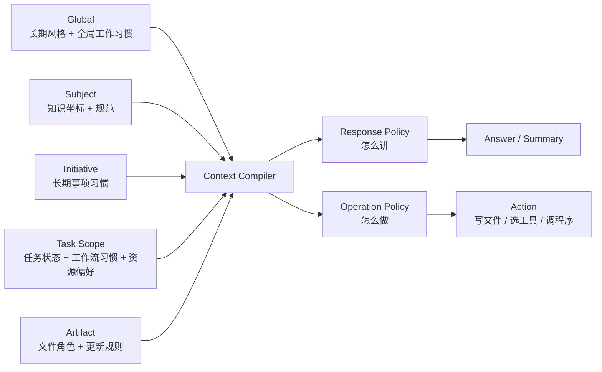

# 用户自适应系统细节总稿

## 1. 这份文档的用途

这份文档不是展示稿，而是细节总稿。

它的目标是：

- 详细记录这套系统到底要解决什么问题
- 明确系统边界和核心原则
- 明确每一层作用域的职责
- 明确记录对象、更新逻辑、调用逻辑和本地存储逻辑
- 明确它如何嵌入 Aether 当前架构

如果别人问：

- 为什么要分 `global / subject / task_scope / artifact`
- 为什么需要 `proposal`
- 为什么不能只做 knowledge base
- 为什么需要本地私有记录
- 这套东西和 Aether 现有 `workspace` / `worktree` 有什么关系

都应该优先来查这份文档。

## 2. 系统现在的准确定位

“用户自适应系统”这个名字还保留着，但系统本身已经比最初的“风格画像”更大。

它现在更准确的定位是：

- 一个由 AI 自己维护的长期上下文系统
- 一个默认本地私有的长期记录系统
- 一个分作用域组织的理解系统
- 一个在回答和执行前进行上下文编译的系统
- 一个逐渐学习用户工作方式、记录方式与操作方式的系统

从对象上看，它已经不只是：

- `signals`
- `summaries`
- `profile`
- `policy`

而是至少还要加上：

- `proposal`
- `subject_profile`
- `task_scope`
- `artifact_contract`
- `context_packet`

## 3. 核心边界

### 3.1 这个系统记录什么

这个系统记录的是与“如何更合适地帮助这个人和这个任务”有关的信息。

包括：

- 用户全局风格与长期互动偏好
- 用户在某个学科中的知识坐标和惯用规范
- 用户的工作顺序、记录习惯、计算习惯、设置习惯等长期或半长期工作特征
- 某个任务当前的目标、状态、已完成工作、决策和未解决问题
- 某个任务里已经形成的工作流习惯，例如 `overview + details` 双文档记录结构
- 某个具体产物的格式、写作重点、插入位置、更新触发条件和输出约束
- 在什么情况下更倾向使用哪个文件夹、程序、skill、脚本或操作方法
- 系统观察到的高价值证据、阶段总结和候选判断

### 3.2 这个系统不直接记录什么

它不直接承担下面这些对象的主存储职责：

- 原始知识内容本身
- 某篇文章或某本书的正文
- 某次讨论形成的完整推导正文
- 研究材料本身
- 已经在 `IPK` 内容系统中作为 `piece` 管理的内容正文

这些应继续由内容系统负责。

## 4. 最重要的总原则

### 4.1 用户负责习惯边界，AI 负责底层组织

这个原则是当前设计里最重要的核心之一。

用户应该主要负责：

- 提出问题
- 提供材料
- 做领域判断
- 纠正 AI
- 确认高影响总结是否准确
- 决定某条习惯是否值得固定
- 决定某条习惯适合在当前 session、当前 project、某个 subject 或更全局范围生效
- 决定习惯是否需要提升、降级、禁用或改写

人不应该负责：

- 设计 AI 的内部 schema
- 决定底层记录怎么组织
- 决定底层检索怎么做
- 决定 embedding 参数
- 决定 AI 如何组合上下文

这意味着：

- 用户界面应该尽量只暴露领域层问题
- 不暴露 AI 内部实现细节作为日常操作前提

### 4.2 AI 负责底层表示与检索

更进一步地说，系统应明确认为：

- AI 最了解什么样的记录结构更适合未来 AI 读取

因此：

- 内部记录可以是 JSON、Markdown、索引、摘要、缓存的组合
- 但这些组合方式主要应由系统设计决定，而不是交给用户手动维护

### 4.3 默认本地优先

这套系统涉及隐私性很强的内容：

- 认知弱区
- 长期工作习惯
- 任务状态
- 写作偏好
- 具体文件路径和产物约束

因此当前强烈推荐：

- 默认全部本地存储
- 不默认上云
- project 引用层记录保存在独立 memory root 的 `projects/` 分区
- global 真源记录保存在独立 memory root 的 `global/` 分区
- subject 真源记录保存在独立 memory root 的 `subjects/` 分区
- task_scope / artifact 真源记录分别保存在独立 memory root 的 `task-scopes/` 和 `artifacts/` 分区
- 第一版不默认把长期 adaptation 真源写入项目目录

### 4.4 慢更新，但不是完全不更新

系统既不能过敏感，也不能失去积累能力。

因此推荐：

- 局部证据可以快速记录
- 中间总结按窗口生成
- 高影响候选结论先进入 `proposal`
- 长期稳定层只在证据足够或用户确认后更新

### 4.5 高影响理解需要确认

所有高影响、可能改变长期工作质量的理解，最好都先作为候选项出现。

例如：

- “用户只想处理物理内容，不想处理 AI 底层”
- “这个任务默认强调严谨推导，不强调发散讨论”
- “课程总结默认写入 `notes/main.tex`”

这类内容不应无声进入长期策略。  
更稳妥的方式是：

- AI 自动提炼
- 生成 `proposal`
- 进入待处理 proposal 队列
- 与同类 proposal 合并和去重
- 给用户统一审阅确认
- 确认后进入稳定层

### 4.6 不只适配讲解，也适配执行

这个系统现在不应该只解决“怎么讲更适合你”。

它还应该解决：

- 怎么做更像你平时的工作方式
- 在什么时候该更新哪些记录性文件
- 有多个同类工具时更应该用哪个
- 用某个程序时应该按什么方法操作

因此它最终面对的是两类任务：

- 回答型任务
- 执行型任务

前者强调解释质量，后者强调操作风格与工作流一致性。

## 5. 分层作用域模型

当前最推荐的**习惯库作用域模型**是**五层平行 scope**（详见 [user-adaptation-system-top-level-constraint.zh-CN.md](/home/bzz/Aether/docs/IPK/02-user-adaptation-system/user-adaptation-system-top-level-constraint.zh-CN.md)）：

```text
global
subject
initiative
task_scope
artifact
```

这五层是**平行**的 scope 标签，**不是树状从属关系**。它们只描述"这条习惯适合在哪个范围被引用"。

`session` 不属于习惯库 scope；它是运行时层，本节末尾单独说明。

### 5.1 `global`

`global` 负责跨任务成立的长期用户风格。

典型内容：

- 偏好更严谨还是更直觉
- 偏好更保守还是更探索
- 是否倾向从已有知识出发
- 对回答长度、抽象层次、边界说明的长期倾向
- 对工作顺序、记录密度、整理节奏的长期倾向

这个层的更新应该最慢。

### 5.2 `subject`

`subject` 负责某个学科或主题中的知识坐标。

典型内容：

- 已有 anchor
- 常用理论语言
- 常用记号体系
- 熟练区与脆弱区
- 在这个学科里更合适的回答组织方式

这个层解决的问题是：

- AI 不知道用户在某个方向里到底会到哪里
- AI 用了另一套规范回答，导致熟悉问题也显得陌生

### 5.3 `initiative`

`initiative` 负责某个长期事项的持续上下文。

它是习惯库五层之一，**不是** Aether 工作区里的 `project`。v1 不建立任何默认的 project ↔ initiative 绑定：一个 project 里可以服务多个 initiative，多个 project 也可以服务同一个 initiative。

典型内容：

- 该长期事项的目标
- 跨多个 task 稳定成立的工作方式
- 该事项范围内的默认资源偏好、记录文件分工
- 该事项内已经拍板的长期决策（不是具体任务的决策）

`initiative` 解决的问题是：task_scope 太窄、subject 太宽，而现实中存在"同一件长期事项下多个 task 共享习惯"的场景。

### 5.4 `task_scope`

`task_scope` 负责某个逻辑任务的持续上下文。

它不是单个 session，也不等于 repo，也不等于 Aether 当前已有的 worktree。

它表示的是：

- 这个用户当前正在推进的一件事

例如：

- 某门课程的长期学习
- 某篇论文的长期写作
- 某个研究问题的持续讨论
- 某个专题笔记的长期整理

它应记录：

- 目标
- 轻量当前状态摘要
- 已完成工作的摘要或引用
- 重要决策的摘要或引用
- 当前关注点的摘要或引用
- open questions 的维护方式和引用
- 相关 subject
- 相关 piece
- 工作流习惯
- 记录性文件的角色分工
- 资源偏好与操作方法
- 当前产物绑定

但 `task_scope` 不应成为具体内容正文库。

例如：

- open-questions 的具体正文应保存在真实 open-questions 文档、IPK piece 或其他 artifact 中。
- `task_scope` 可以记录“本任务需要维护 open-questions，并在拍板后收敛到 implementation-decisions”。
- `task_scope` 可以保存对应 artifact 的引用、更新时间和极短状态摘要。
- `task_scope` 不应复制 open-questions 的全部具体内容。

### 5.5 `artifact`

`artifact` 负责某个具体输出目标。

例如：

- 一个 LaTeX 文件
- 一篇论文草稿
- 一份课程总结
- 一个固定格式的笔记文档

它应记录：

- 文件路径
- 文件角色，例如 `overview`、`details`、`notes`
- 文件格式
- 写入模式
- 插入锚点
- 更新触发条件
- 是否与其他 artifact 成对或成组更新
- 风格重点
- 必须保留的宏或结构
- 不能自动改动的区域

### 5.6 `session` 不是库 scope

`session` 属于 Session 运行时层，而**不是**习惯库五层之一。

它承载：

- 本 session 内用户明确表达的临时要求（scratch habits 的一部分）
- 从习惯库五层通过 scope matching 取回的引用
- 两者**并列**构成运行时真正生效的集合

session 可以覆盖上层长期设置，但默认不直接改写习惯库真源。session 层的产物只能通过 proposal → confirmed 流程进入五层习惯库。

### 5.7 作用域优先级

未来真正编译上下文时，推荐采用下面的覆盖顺序：

```text
session 运行时（当前用户要求 + scratch habits）
  > artifact
  > task_scope
  > initiative
  > subject
  > global
```



这样可以避免历史记录把当前明确要求压掉。

## 6. 核心对象

本节解释用户自适应系统的核心对象，以及它们在“证据 -> 候选结论 -> 已确认长期记录 -> query-time context packet”链路中的职责。

## 6.1 `signals`

`signals` 是最小证据单位。

它表示：

- 系统在某次会话中观察到的一个局部信号

它仍然适合记录：

- 风格偏好证据
- 知识起点证据
- 规范偏好证据
- 任务原则证据
- 产物约束证据

当前 v1 约束补充：

- 自动提取快链路先只读取当前 session 的用户消息；assistant 文本只可作为理解上下文的辅助，不作为 habit evidence。
- 文件改动、工具操作和更广证据来源不在 v1 默认接入范围内，后续再评估。

### 推荐字段

```json
{
  "id": "sig_20260407_001",
  "session_id": "ses_xxx",
  "scope": {
    "level": "subject",
    "target": "statistical-mechanics"
  },
  "kind": "prefers_rg_language",
  "confidence": 0.78,
  "evidence": [
    {
      "source": "user_message",
      "ref": "msg_123",
      "quote": "尽量先用我熟悉的统计物理语言来讲。"
    }
  ],
  "note": "用户再次要求优先使用熟悉语言。"
}
```

## 6.2 `summaries`

`summaries` 是阶段性中间层。

它的作用是：

- 对一段时间的 signals 做压缩
- 输出可读趋势
- 为后续 profile / policy / proposal 更新提供依据

它不是永久真相，也不应该被当成最终画像。

## 6.3 `proposals`

`proposals` 是这次设计里的关键新增对象。

它表示：

- AI 从多次证据中提炼出一个值得进入长期记录的候选判断
- 但这个判断影响较大，最好先给用户确认

### 典型适用场景

- 核心工作原则
- 重要写作偏好
- 特定任务中的重点与边界
- 默认写入文件和写作结构

### 推荐字段

```json
{
  "id": "prop_20260407_001",
  "scope": {
    "level": "task_scope",
    "target": "scope_statmech_course_2026"
  },
  "kind": "task_principle",
  "summary": "用户希望自己决定习惯边界和高影响默认，AI 负责底层存储、检索与架构。",
  "impact": "high",
  "confidence": 0.83,
  "evidence_refs": ["sig_20260407_010", "sig_20260407_014"],
  "status": "pending"
}
```

### 推荐状态

- `pending`
- `deferred`
- `confirmed`
- `rejected`

第一版 proposal 不应一生成就打断用户，也不应一生成就写入长期层。

更推荐的流程是：

```text
candidate proposal
  -> merge / deduplicate
  -> pending queue
  -> user batch review
  -> confirmed / rejected / deferred
```

同类 proposal 应合并。合并时至少应考虑：

- `scope.level`
- `scope.target`
- `kind`
- 写入目标对象
- 未来会改变的默认行为
- 语义相似度

合并后的 proposal 必须保留关键 evidence refs，并尽量展示“为什么这些候选被认为是同一类”。

## 6.3a 习惯传递通道

习惯传递通道用于解决一个核心问题：用户习惯通常先在某个 session 中被观察到，但真正有价值的长期习惯可能应该作用于 `task_scope`、`initiative`、`subject` 甚至 `global`。如果未来引入 `workflow_profile`，那属于 vNext，不是当前正式 scope。

`scope matching`、`scope read`、`scope promotion` 的集中机制说明见：

- [user-adaptation-system-scope-mechanics-v1.zh-CN.md](/home/bzz/Aether/docs/IPK/02-user-adaptation-system/user-adaptation-system-scope-mechanics-v1.zh-CN.md)

第一版推荐把这个过程称为 `scope promotion`，即作用域提升。

推荐链路是：

```text
session evidence
  -> signal
  -> session / task summary
  -> promotion candidate
  -> merged proposal
  -> user batch review
  -> confirmed higher-scope profile / policy
```

这条链路是慢晋升通道，用于 AI 从长期趋势中提出建议。它不应替代用户显式指定作用域的快通道。

当用户明确说“这是全局习惯”“只在当前任务里这样”“这个项目以后都这样”时，系统应直接生成目标作用域 proposal，并展示模型建议、用户选择、来源证据和未来影响。AI 可以建议更合适的作用域，但不能静默覆盖用户选择。

各层职责：

- session evidence 只表示本次对话或行动中发生了什么。
- signal 是最小证据单位，可以自动生成，但不应直接改变高层长期行为。
- summary 在同一 scope 内压缩多个 signals，用于判断趋势是否稳定。
- promotion candidate 表示系统认为某个趋势可能不应只留在原 scope。
- proposal 负责把高影响或更广作用域的提升交给用户确认。
- confirmed higher-scope record 才能真正影响更多未来 session / project。

第一版人机分工：

- AI 自决适合低影响、局部、可逆的记录，例如 session signal、task summary、context_packet 缓存、已确认习惯的 evidence / confidence 更新。
- AI 询问用户适合中高置信度但作用域不确定的候选，例如某个 task 习惯是否应提升为 initiative policy。
- 用户必须决定高影响提升，例如写入 `global_guidance`、提升为更广作用域的工作流类习惯、文件写入规则、工具选择、自动联动和默认工作流。

因此第一版可以允许 AI 自动发现“可能应该提升”的候选，但不允许 AI 静默把 session 习惯提升成 initiative / subject / global 习惯。

用户自适应系统的长期真源应被看作一个独立习惯库。工作区、repo、project 和 session 只是向这个库提交证据、proposal 和引用请求；它们不应和习惯真源混成同一层对象。工作区通过 scope matching、索引和映射关系从习惯库中取回相关记录。

习惯库内部的 `global / subject / initiative / task_scope / artifact` 五层是平行 scope 标签，不是树状归属关系。Aether 工作区侧另有 `global_guidance` / `project_guidance` / `session binding` 三类工作区对象；当前运行时真正生效的小集合应理解为 `imported active habits + scratch active habits`，其中 imported 分支通过 session binding 的 `habit_ids` 进入，scratch 分支来自当前 session scratch 区。`global_guidance` 和 `project_guidance` 主要按 subject 分块为 session matching 提供强参考。所有这些工作区记录都只保存**轻量背景 + refs**，不保存习惯正文真源。

这里还需要明确一层运行时语义：`session binding` 中的 `initiative_id / task_scope_id / subject_ids / artifact_ids` 应理解为“当前 session 的实际挂载状态”，不是候选池，也不是历史累计袋子。

当用户把一个习惯提升或降级时，不应默认删除旧习惯并重新入库。推荐做法是创建或更新目标作用域记录，并用 `promotes_from`、`supersedes`、`derived_from`、tombstone 或 redirect 保持引用完整。只有用户明确选择“从真源删除”时，才物理删除旧记录。

这里需要区分：

- `scope matching`
  判断当前请求、signal 或 context_packet 和哪些层级相关。
- `scope read`
  从相关层级读取少量记录并编译进运行时上下文。
- `scope promotion`
  把低层习惯写入更高层级，让它以后影响更大范围。

前两者应尽量自动完成，只在低置信度或冲突时询问用户。第三者如果会扩大长期影响范围或改变默认行动方式，才必须进入 proposal 确认。

当用户显式要求“整理我的习惯”或“把这个以后都这样做”时，系统可以主动生成 promotion proposal，但仍应展示来源证据、原始 scope、目标 scope、写入对象和未来影响。

## 6.4 `profile`

`guidance`、`profile`、`policy` 不应再混成一类。

当前至少应先区分两组对象：

- 工作区 guidance 对象
  - `global_guidance`
  - `project_guidance`
- 习惯库内部 profile 对象
  - `subject_profile`
  - `initiative_profile`

### `global_guidance`

负责工作区 global 侧的轻量背景 + refs，用来在 query time 给 session 提供跨项目、跨任务的候选缩圈参考。

运行时上，当前实现会先看显式 binding / matcher；线索不足时，再把 `project_guidance + global_guidance` 一起作为 guidance 缩小候选范围。

### `subject_profile`

负责某个学科中的知识坐标。它是习惯库 `subject` 层的正式真源对象，不是 guidance 的别名；工作区 guidance 中出现的 `subject_ids` 只是帮助缩圈的 refs。

### `project_guidance`

负责当前项目的稳定背景、跨 task_scope 成立的约束，以及 subject、task_scope、artifact、IPK piece 的引用关系。

`project_guidance` 不保存项目正文，也不替代 artifact、task_scope 或 IPK piece。

这里的 `project_guidance` 属于 Aether 工作区引用层；习惯库五层里对应的长期事项 scope 叫 `initiative`。initiative 的归属**不由 Aether project/worktree/repo 绑定推导**，而是由 v1 的分层路由 classifier 在 proposal confirm 阶段独立决定。

**v1 不建立任何默认的 Aether project ↔ initiative 绑定**。detail 参见 [docs/decisions/project-initiative-decoupling-and-routing.md](../../decisions/project-initiative-decoupling-and-routing.md)：

- 创建 / 打开 Aether project 时禁止自动创建对应 initiative；
- `initiative_id` 不得由 `project_id` 派生；
- Aether project / worktree 可作为 classifier 的上下文信号之一，但不是 initiative 的身份来源；
- 一个 Aether project 可天然关联多个 initiative，一个 initiative 也可被多个 project 的 session 引用，均通过 classifier 路由而非硬绑定实现。

推荐字段包括：

- `summary`
- `stable_context`
- `subject_ids`
- `task_scope_refs`
- `artifact_refs`
- `ipk_piece_refs`

更直白地说：

- `project_guidance` 不是纯索引表，因为新 session 仍需要一个“这个工作区现在在做什么、有哪些稳定背景”的快速入口。
- 但它也不能长成第二个内容库；如果一段信息已经变成长期规则正文、任务正文或知识正文，就应该分别进入习惯库、task_scope / artifact 或 IPK。

## 6.5 `policy`

`policy` 不是描述用户是什么样，而是描述系统接下来应该怎么做。

它仍然是必要对象，因为：

- `profile` 描述理解
- `policy` 描述回应策略

现在最推荐把 `policy` 理解成两部分：

- `response_policy`
  决定如何组织解释、从哪里切入、讲到多深、怎样桥接抽象形式

- `operation_policy`
  决定如何组织动作、先做什么、是否要同步更新记录文件、优先用哪个工具或目录、怎样调用资源

`operation_policy` 典型会覆盖：

- 默认工作顺序
- 记录文件更新规则
- 计算过程保留或压缩方式
- 环境设置与目录使用习惯
- 工具 / 程序 / skill 的选择偏好
- 同类资源可选时的默认操作方法

而且现在 `policy` 也应允许分层存在：

- `global policy`
- `subject policy`
- `initiative policy`
- `task policy`
- `artifact contract`

长期 policy 的覆盖顺序是：

```text
artifact_contract
  > task_scope policy
  > initiative policy
  > subject policy
  > global policy
```

所有 adaptation policy 都不能覆盖系统 / developer 指令、权限判断、当前用户明确要求或 repo 内 `AGENTS.md` 这类项目级 agent 指令。

## 6.6 `task_scope`

`task_scope` 是当前新架构里最关键的新对象之一。

它的边界是：

- 保存任务级习惯、轻量状态、维护规则和引用。
- 不保存具体内容正文。
- 不替代 artifact、IPK piece 或项目文档。

### 推荐字段

```json
{
  "id": "scope_adaptation_docs_2026",
  "project_id": "proj_xxx",
  "title": "用户自适应系统文档设计",
  "kind": "design",
  "goal": "持续讨论并完善用户自适应系统文档，同时维护适合展示的 overview 和可查询的 details。",
  "active_subjects": ["user-adaptation-system", "aether-architecture"],
  "principles": [
    "用户决定习惯作用范围和高影响默认，AI 负责底层组织、记录、匹配与执行编排。"
  ],
  "status_summary": "当前在扩展系统，使其不仅适配讲解，也适配工作与操作习惯。",
  "workflow_habits": {
    "recording_pattern": "maintain paired overview/details docs",
    "preferred_sequence": [
      "discuss",
      "extract_principles",
      "update_overview",
      "update_details"
    ],
    "calculation_style": "先保留推理与约束，再压缩成展示语言。",
    "setup_style": "优先复用项目内已有目录、skills 与程序。"
  },
  "resource_preferences": [
    {
      "when": "更新记录性文件",
      "prefer_roles": ["overview", "details"],
      "method": "先更新 overview，再同步 details。"
    },
    {
      "when": "有多个同类工具可选",
      "prefer": "优先复用项目内已有文件、skills 与程序",
      "reason": "减少额外结构和迁移成本。"
    }
  ],
  "done": [
    "已经完成一轮 overview / details / schema / integration 文档重写。"
  ],
  "decisions": [
    "记录默认本地私有保存。",
    "记录性文档保留 overview 与 details 双文档结构。"
  ],
  "open_questions": [
    "操作习惯与工具偏好应如何稳定提取并确认。"
  ],
  "open_question_refs": [
    {
      "artifact_id": "artifact_adaptation_open_questions_zh",
      "path": "docs/IPK/02-user-adaptation-system/user-adaptation-system-open-questions.zh-CN.md",
      "note": "具体问题正文以该文件为准。"
    }
  ],
  "linked_pieces": ["piece_20260407_001"],
  "artifacts": [
    "artifact_adaptation_overview_zh",
    "artifact_adaptation_details_zh"
  ],
  "confidence": 0.84
}
```

## 6.7 `artifact_contract`

`artifact_contract` 负责最终产物写入。

### 推荐字段

```json
{
  "id": "artifact_adaptation_overview_zh",
  "task_scope_id": "scope_adaptation_docs_2026",
  "role": "overview",
  "bundle_id": "adaptation_docs_zh",
  "path": "docs/IPK/02-user-adaptation-system/user-adaptation-system-overview.zh-CN.md",
  "format": "markdown",
  "write_mode": "revise_in_place",
  "update_triggers": [
    "on_major_direction_change",
    "on_user_request_update_record_docs"
  ],
  "style_focus": [
    "vision",
    "motivation",
    "main_architecture",
    "roadmap"
  ],
  "partner_artifacts": [
    "artifact_adaptation_details_zh"
  ],
  "protected_regions": [
    "# 用户自适应系统总览"
  ]
}
```

## 6.8 `context_packet`

`context_packet` 是 query time 的编译结果，不一定需要长期保存为最终真源。

它表示：

- 当前这一轮请求，最终真正喂给模型的上下文包

第一版存储规则：

- session db 可以保存 `context_packet_snapshot`，用于审计、调试和 UI 检查。
- session db 可以保存 `context_packet_id`，引用一次编译结果。
- 如果完整 context packet 需要落盘，应写入 `MemoryPath.cacheRoot()/adaptation/context-packets/`。
- cache 中的 context packet 可以清理或重建，不能成为长期用户习惯的唯一真源。

推荐结构：

```json
{
  "request_id": "req_xxx",
  "session_id": "ses_xxx",
  "task_scope_id": "scope_adaptation_docs_2026",
  "artifact_ids": [
    "artifact_adaptation_overview_zh",
    "artifact_adaptation_details_zh"
  ],
  "subject_ids": ["user-adaptation-system", "aether-architecture"],
  "sections": [
    {
      "kind": "global_guidance",
      "text": "用户通常希望从已有知识切入。"
    },
    {
      "kind": "task_scope",
      "text": "当前任务默认维护 overview 与 details 两份记录文件，并先更新展示稿，再补细节稿。"
    },
    {
      "kind": "artifact_contract",
      "text": "当用户要求更新记录文件时，应优先改 overview，并同步检查 details 是否需要补实现逻辑。"
    },
    {
      "kind": "operation_policy",
      "text": "同类资源可选时，优先复用当前 project 内已有文件、skills 与程序。"
    }
  ]
}
```

## 7. 为什么不能只做一个 profile

如果只有一个 profile，会出现三个问题。

### 7.1 学科差异会被抹平

用户在统计物理里熟悉的语言，和在别的方向里熟悉的语言可能完全不同。

### 7.2 项目状态会污染长期画像

某个项目里的临时写作要求，不应该变成全局习惯。

### 7.3 具体产物约束会无处安放

LaTeX 文件的宏包、锚点和写法约束，不应写进全局 user profile。

### 7.4 工具与操作偏好也具有强场景性

同一个用户在不同 task scope 里，可能会：

- 习惯不同的记录结构
- 选用不同的文件夹
- 偏好不同的程序
- 用不同的方法操作同一个程序

这些都不适合塞进单一全局画像。

因此：

- `profile` 必须分层
- `task_scope` 必须独立
- `artifact_contract` 必须独立

## 8. 为什么不能只靠 knowledge base

当前 Aether 已经有 knowledge base 能力，但它更接近：

- 材料索引与 RAG

它适合回答：

- “材料里有什么”

但不够回答：

- “这个用户在这个学科里已经会到哪里”
- “这个具体任务当前做到哪里”
- “这个文件该怎么写”
- “现在该更新 overview 还是 details”
- “同类工具里更应该选哪个程序或路径”

所以 knowledge base 可以继续作为材料层使用，但不能替代这套系统。

## 9. 本地存储设计

本节只说明本地存储的设计原则和关键锚点。完整目录树以跨系统存储契约为唯一权威来源，避免多份说明文档重复维护后出现细微漂移。

## 9.1 总体原则

推荐把存储分成两类：

- 规范记录
- 派生缓存

### 规范记录

用户真正可以审阅、也应被长期保留的记录。

### 派生缓存

为了加速检索、编译和路由而生成的内部缓存。

## 9.2 推荐目录

### 全局记录

推荐通过独立 `MemoryRootResolver` 获取用户自适应系统根目录，业务代码不应直接硬编码 `${Global.Path.config}` 或平台绝对路径。

逻辑位置：

```text
MemoryPath.adaptationRoot()/global/
```

完整子树以 [ipk-and-adaptation-storage-access-contract.zh-CN.md section 4.2](/home/bzz/Aether/docs/IPK/ipk-and-adaptation-storage-access-contract.zh-CN.md) 为准。这里适合保存：

- `global-policy.json`
- `global-policy.md`

### 工作区引用层与独立真源

逻辑位置：

```text
MemoryPath.adaptationRoot()/workspace/global-guidance.json
MemoryPath.adaptationRoot()/workspace/projects/<project_id>/
```

完整子树以 [ipk-and-adaptation-storage-access-contract.zh-CN.md section 4.2](/home/bzz/Aether/docs/IPK/ipk-and-adaptation-storage-access-contract.zh-CN.md) 为准。这里适合保存：

- `global-guidance.json`
- `global-guidance.md`
- `project-guidance.json`
- `project-guidance.md`

当前 session 运行时文件应放在：

```text
MemoryPath.adaptationRoot()/bindings/sessions/<session_id>/
```

其中包括：

- `<session_id>.json`（session binding）
- `scratch-habits.json`
- `scratch-conflicts.json`
- `proposals/<status>/...`

而 initiative 真源应放在：

```text
MemoryPath.adaptationRoot()/initiatives/<initiative_id>/
```

其中至少包括：

- `initiative-profile.json`
- `initiative-profile.md`
- `initiative-policy.json`
- `initiative-policy.md`

task_scope 真源应放在：

```text
MemoryPath.adaptationRoot()/task-scopes/<scope_id>/
```

其中至少包括：

- `scope.json`
- `scope.md`
- `policy.json`
- `policy.md`
- `summaries/*.json`
- `proposals/*.json`

artifact 真源应放在：

```text
MemoryPath.adaptationRoot()/artifacts/<artifact_id>/
```

其中至少包括：

- `contract.json`
- `contract.md`
- `summaries/*.json`
- `proposals/*.json`

当前倾向是：

- session 只作为证据来源和绑定对象。
- 长期 task / artifact 级 adaptation 记录不放在单个 session 目录下作为真源。
- project / worktree 是第一版任务级记录的逻辑边界和匹配依据。
- 工作区引用层记录默认在 `MemoryPath.adaptationRoot()/workspace/projects/<project_id>/`。
- task_scope / artifact 的物理真源不在 `projects/<project_id>/` 下。
- 第一版不导出或同步到 `<worktree>/.opencode/adaptation/` 或 `<worktree>/.aether/adaptation/`。
- `<worktree>/.opencode/adaptation/` 以后可以按 `pointer -> explicit export -> one-way sync -> two-way sync` 顺序逐步评估，但不作为第一版默认真源。
- global / subject 等跨项目记录使用同一个独立 memory root，但 `global/` 与 `subjects/` 必须是并列顶层分区。
- session db 只保存 `session_id -> project_id`、`task_scope_id`、`subject_ids`、`habit_ids`、`signal_ids`、`proposal_ids`、`context_packet_id`、`context_packet_snapshot` 等绑定、引用和快照。
- session db 不保存工作区 global guidance、subject profile、initiative policy、task_scope、artifact contract 或 IPK piece 的唯一长期真源。

需要注意，讨论“放在哪里”不是否认分层记录。  
系统仍然可以同时有 `global`、`subject`、`task_scope`、`artifact`、`session` 等层级；真正需要拍板的是每一层记录的物理真源、引用方式和同步方式。

### 派生缓存

推荐仍可放在独立 memory root 的缓存分区，例如：

```text
MemoryPath.cacheRoot()/adaptation/
```

这里适合保存：

- 编译缓存
- `context-packets/<context_packet_id>.json`
- 检索索引
- 派生 embedding 或快速路由缓存

## 9.3 为什么要 Markdown 和 JSON 双视图

推荐采用：

- JSON 作为结构化稳定读写层和唯一真源
- Markdown 作为从 JSON 渲染的人类和 AI 都容易快速审阅的镜像层

这样做的好处是：

- 系统更新更稳定
- AI 编译上下文更容易
- 用户需要检查时也能直接读

第一版规则：

- 每次写入或确认长期 JSON 记录后，同步重新生成对应 Markdown。
- 用户可以查看 Markdown，但第一版不把手工编辑 Markdown 作为写回 JSON 的入口。
- 如果 JSON 与 Markdown 冲突，以 JSON 为准，并重新渲染 Markdown。

## 9.4 隐私与版本控制

既然记录里可能包含敏感上下文，推荐：

- 第一版默认不把长期 adaptation 真源写入项目目录，因此默认不产生 git 变更。
- 第一版不做导出或同步到 `<worktree>/.opencode/adaptation/` 或 `<worktree>/.aether/adaptation/`。
- 如果未来用户显式导出或同步到这些路径，这些路径默认不应入 git。
- Aether 可以在未来显式导出/同步时维护 `.git/info/exclude` 或等价忽略机制。

这样可以减少误提交风险。

## 9.5 权限问题

推荐把两类写入分开看：

### 适配记录写入

这类写入是系统自有私有记录，应该尽量落在 Aether 自己能稳定管理的目录里，避免频繁打断用户。

### 产物文件写入

这类写入会真正改用户文件，例如 LaTeX、论文草稿、笔记。

这类操作仍然应复用 Aether 现有权限与确认机制，不能假设总是可以静默改用户文件。

## 10. 更新逻辑

## 10.1 `on_session_end`

每次会话结束后，系统可以做：

- 提取 `signals`
- 更新任务级短期状态
- 生成候选 `summary`
- 在必要时生成 `proposal`
- 提取工作顺序、记录习惯、工具选择和操作方法相关证据

但不建议直接重写长期 `global_guidance`。

这里的“会话结束”不一定要求用户关闭窗口。  
第一版可以把一次 assistant 响应完成、session summary 更新完成，视为一次可运行后台提取的时机。用户也应能通过显式按钮触发“整理当前对话习惯”。

## 10.2 `on_summary_window`

到达一定窗口后，系统可以：

- 汇总最近 N 次相关会话
- 生成 `summaries`
- 评估哪些结论足够稳定

窗口可以按：

- 次数
- 时间
- 变化幅度

触发。

它和 `on_session_end` 不重复：

- `on_session_end` 负责从单次对话或行动中提取局部 signal。
- `summary_window` 负责把多次相关 signal 压缩成趋势。
- `proposal` 负责把高影响趋势送给用户确认。

## 10.3 `on_high_impact_inference`

当系统推断出高影响内容时：

- 先生成 candidate `proposal`
- 与同类 proposal 合并或去重
- 放入 pending proposal 队列
- 不直接应用
- 等待用户统一审阅确认

需要控制打扰频率：

- 同类高影响 signal 可以合并成一条 proposal。
- 已确认习惯后，后续同类 signal 只增加证据或置信度。
- 未确认习惯可以先累积，到达阈值或用户显式整理时再批量提示。
- 被拒绝 proposal 应进入冷却，避免短期内反复生成。
- 被暂缓 proposal 应保留在队列中，但降低提醒优先级。

## 10.4 `on_user_confirm`

确认后：

- 更新 `profile` / `policy`
- 更新 `task_scope`
- 更新 `artifact_contract`

## 10.5 各层更新灵敏度

推荐如下：

- `global`
  最慢，需要多次证据

- `subject`
  中慢，允许用户显式校准加速

- `task_scope`
  中快，任务状态天然变化较快

- `artifact`
  最快，但应尽量来自显式绑定和文件解析，而不是纯猜测

## 11. 查询时的上下文编译逻辑

推荐每次问答前都跑一遍 `context compiler`。

## 11.1 识别当前请求类型

例如：

- 学习型问题
- 研究型问题
- 写作型问题
- 总结并记录
- 直接写文件
- 工具或程序操作型请求
- 更新记录文件

## 11.2 判断当前最相关的 subject

不要总是只用全局 profile。

## 11.3 判断当前是否属于某个 task_scope

如果 session 已经绑定了 scope，就直接使用。  
如果没有绑定，可以结合：

- 当前 project
- 最近相关 session
- 当前打开文件
- 当前 artifact
- 当前主题

做推荐或自动推断。

## 11.4 拉取各层记录

推荐只拉少量高价值记录：

- 相关 global notes
- 相关 subject profile
- 当前 task policy
- 当前 task_scope summary
- 当前 artifact contract
- 当前资源偏好
- 必要时相关 piece 摘要

## 11.5 编译成短上下文包

最终给模型看的不应该是一堆原始 JSON。

`context compiler` 也不应该读取过多长期记录。  
它应像一个运行时整理助手，只挑出和当前请求最相关的少量习惯、任务规则、产物规则和学科偏好。

更合理的方式是编译成结构化短文本，例如：

```text
[Global]
用户通常希望先从已有知识出发来理解问题。

[Subject: user adaptation system]
先从已有的系统主线与作用域结构出发，再逐步展开到 schema、Aether 集成和实现细节。

[Task Scope]
这次对话属于用户自适应系统文档设计任务。目标不只是讨论方案，也包括维护可展示的 overview 与可查询的 details。

[Artifact]
当用户要求更新记录文件时，应优先修改 overview，并同步检查 details 是否需要补充实现逻辑。

[Operation]
当用户说“更新记录文件”时，默认同时检查 overview 与 details 两份文档，先更新展示稿，再同步细节稿。
```

## 12. 与 IPK 内容系统的关系

当前最推荐的关系是：

- IPK 内容系统负责长期内容库
- 用户自适应系统负责长期理解与上下文编译

在具体对象关系上，推荐：

- `task_scope` 记录 `linked_pieces`
- `context compiler` 可在必要时引用相关 piece 的 surface 或 summary
- 不在适配系统里重复存 piece 正文

## 13. Skills 在这里扮演什么角色

当前讨论里提到过 `skills + markdown` 的思路。

现在最推荐的理解是：

- `skills` 负责流程
- 本地记录负责数据

也就是说：

- skill 可以定义“如何读取 subject profile、task scope、artifact contract，并组织动作”
- skill 也可以在执行时读取 `operation_policy`，决定该优先调用哪个流程或程序
- 但不断变化的用户和任务数据，不应直接写死在 skill 里

## 14. Aether 集成方式

## 14.1 现有适合复用的部分

Aether 已经有几处非常合适的挂点：

- session 生命周期
- `SessionPrompt.prompt()` 的 prompt 组装点
- `SessionSummary.summarize()` 的会话后处理点
- project / directory / session 基础结构
- SSE / GlobalBus / global-sync

## 14.2 最重要的命名调整

Aether 现有代码里已经有：

- worktree 相关的 workspace 语义
- control-plane 里的 experimental workspace

所以这次新增的“逻辑任务空间”不应继续叫 `workspace`。

当前最推荐的代码命名是：

- `task_scope`

这样可以明确区分：

- Git worktree
- remote workspace
- logical task scope

## 14.3 推荐后端模块

```text
packages/opencode/src/adaptation/
  signal.ts
  summary.ts
  proposal.ts
  profile.ts
  policy.ts

packages/opencode/src/task-scope/
  index.ts
  scope.ts
  storage.ts
  matcher.ts

packages/opencode/src/artifact/
  contract.ts
  writer.ts

packages/opencode/src/context/
  compile.ts
  packet.ts
```

## 14.4 推荐路由方向

```text
/adaptation/global
/adaptation/subjects
/adaptation/proposals
/task-scope
/artifact
```

`context compiler` 更适合作为内部服务，而不是一开始就做公开 API。

## 14.5 前端建议

前端更适合暴露这些概念：

- 当前任务是什么
- 最近系统对这个任务的理解是什么
- 哪些高影响总结待确认
- 当前产物绑定到了哪些文件
- pending proposal 队列
- 同类 proposal 合并后的审阅结果

而不适合暴露：

- embedding provider
- chunk size
- 内部索引细节

## 14.6 和当前 knowledge 的关系

当前 knowledge 更像材料库和 RAG 层。  
它可以继续复用，但不应承担：

- subject profile
- task scope
- artifact contract
- proposal confirmation

这些职责。

## 15. 可行性与分阶段实现

这套方案是可行的，但完整版本代码量会很大。

### 15.1 为什么它可行

因为 Aether 已经有：

- session
- prompt injection
- 后处理
- project/worktree
- event stream
- local storage

真正缺的是：

- 逻辑任务层
- 分层记录层
- 上下文编译层

### 15.2 为什么不能一口气全做完

因为真正的复杂度不在“存几个 json”，而在：

- 怎样避免误判
- 怎样控制上下文大小
- 怎样区分全局、学科、任务和产物层
- 怎样把高影响推断做成可确认流程

### 15.3 推荐分阶段

#### 第一阶段

- `task_scope`
- `proposal` 确认流
- 本地记录和基础编译

先把长期任务边界和关键确认流做稳。

#### 第二阶段

- `artifact_contract`
- 成对记录文件工作流
- “更新记录文件” 的基础执行链

这一步先解决最容易感知到价值的记录工作流问题。

#### 第三阶段

- 小规模 `operation_policy`
- 工具 / 路径 / 程序偏好
- 工作顺序、记录顺序、设置习惯的初步适配

这一步开始让 AI 的操作更像用户自己在做。

#### 第四阶段

- `subject_profile`
- 学科级知识坐标与规范对齐

这一步解决“AI 不知道我在这个方向里会到哪里”的问题。

#### 第五阶段

- 更慢更新的 `global_guidance`
- 更完整的 `policy`
- 适度纠偏逻辑
- 与 IPK 内容系统深度联动
- 更复杂的路由和自动推荐

### 15.4 粗略工程量判断

如果只做保守 MVP，大致是中等偏大规模。

如果做：

- task scope
- artifact contract
- proposal confirm
- context compiler

这部分大约可以看作一轮中等偏大的功能开发。

如果把：

- global
- subject
- task
- artifact
- IPK 联动
- 自动文件写入

全做完整，那就会是明显的大功能，不适合无计划地直接开写。

## 16. 当前最重要的设计结论

当前最重要的结论不是某个单独字段，而是下面这几条：

1. 这套系统的底层组织应由 AI 负责，而不是交给用户维护。
2. 记录默认应保存在本地，优先考虑隐私与可审阅性。
3. 系统必须分清 `global / subject / task_scope / artifact` 四层长期作用域。
4. 高影响理解应先形成 `proposal`，在关键时机给用户确认。
5. 系统必须学习“怎么回答”，也必须学习“怎么做事”。
6. 最终真正影响行为的不是单个 profile，而是 `context compiler`。
7. 在 Aether 里，这个新对象不应再叫 `workspace`，而应明确叫 `task_scope`。
8. 低层习惯提升到高层必须有显式 `scope promotion` 通道，且高影响提升需要用户确认。
