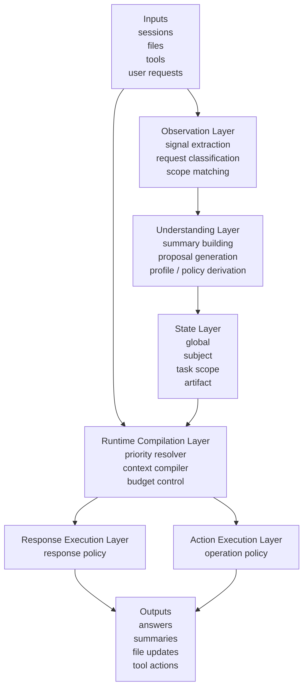
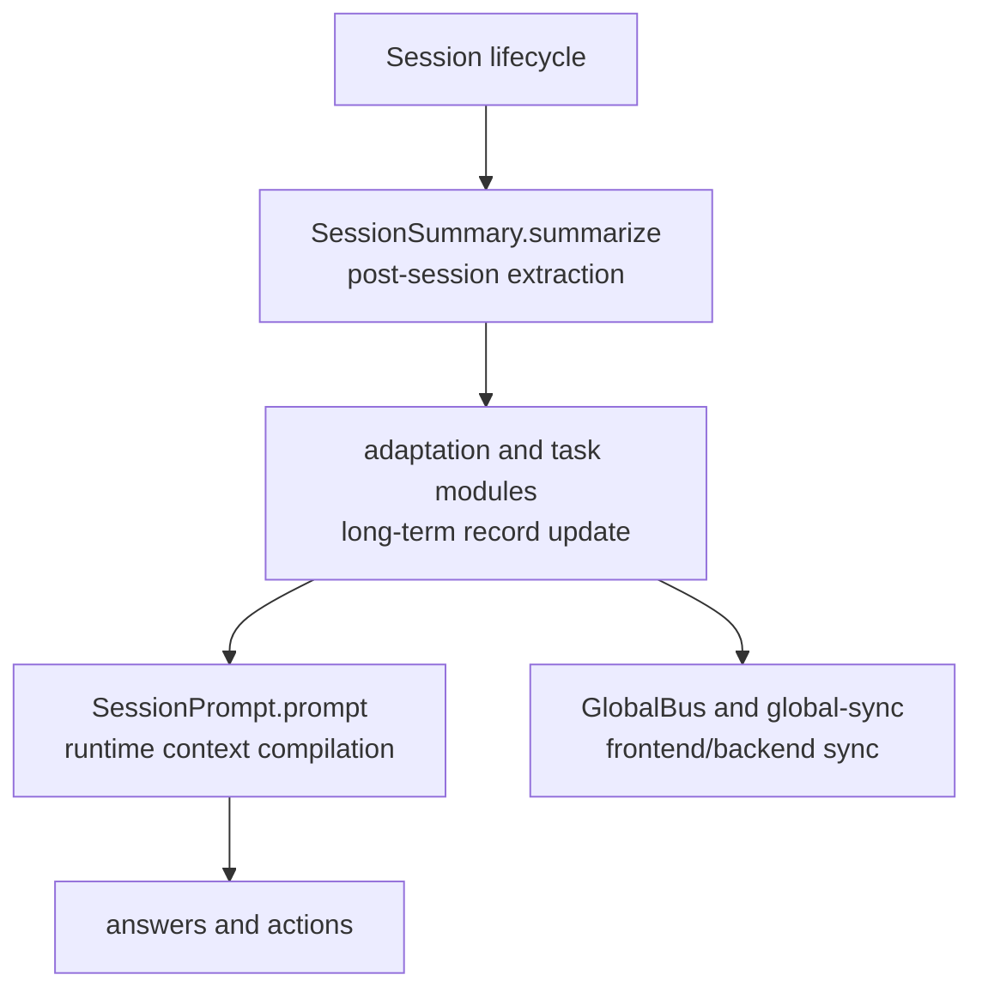
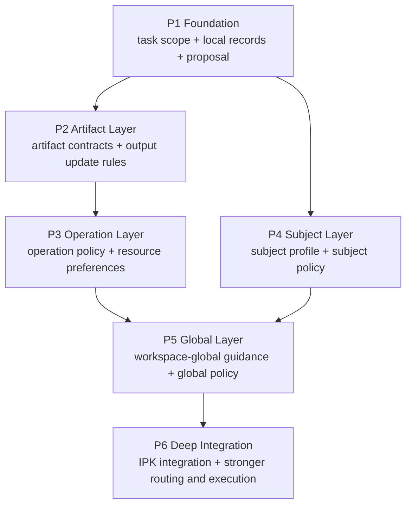

# User Adaptation System Overview

## One-line Definition

This project is not a lightweight chat-memory feature or a simple preference log.

It is an AI-maintained, local-first, multi-scope long-term context system.  
Its purpose is to help the AI gradually learn:

- how this user is usually best explained to
- what this user already knows inside different subjects and which conventions feel natural there
- what state a long-running task is in and what workflow habits have formed inside it
- how concrete artifacts, tools, paths, and operating procedures should usually be handled

and then compile that understanding back into future answers and actions.

## What Problems It Solves

The real weakness of modern AI is often not lack of knowledge.  
It is lack of understanding of the specific person and the specific task.

That creates several systemic failures:

- explanation mismatch
  The AI explains too shallowly, too heavily, too abruptly, or in an unfamiliar formal language.

- knowledge-coordinate mismatch
  The AI does not know where the user's real starting point is inside one subject.

- task-continuity mismatch
  The AI does not know what has already been done, decided, or left unresolved in a long-running task.

- artifact-generation mismatch
  The AI does not know how a class of outputs should be structured, where they belong, or which related outputs should be updated together.

- workflow and operation mismatch
  The AI does not know how the user usually selects tools, directories, programs, or execution order when doing real work.

That is why the goal here is not merely "better memory."  
The goal is a long-term assistant that can organize both explanation and execution around a stable understanding of the user and the work.

## Core Principles

### 1. The user decides habit boundaries, the AI handles low-level organization

The user-adaptation system has a different human / AI split from the IPK content library.

For IPK content, the user should mostly care about physical materials, files, and knowledge pieces, while the AI handles maps, indexes, routing, and connections.  
For user adaptation, the user knows their own habits best, so the user should have stronger control over review, scope choice, promotion, narrowing, disabling, and correction.

The principle is:

> The user decides which habits are worth fixing, where they should apply, and when they should be promoted or narrowed.  
> The AI understands candidate habits, maintains the structured habit library, builds indexes and relations, and matches / references habits at runtime.

The user should not be responsible for:

- schemas
- index structures
- retrieval strategy
- prompt composition
- low-level tool-routing logic

But the user should be able to conveniently manage:

- current session habits
- the target scope of pending habits
- whether project / global reference habits should keep being used
- whether a habit should be promoted, narrowed, disabled, or rewritten

### 2. The system must be scoped and graph-like, not a tree

What matters in practice is not one flat user profile.

The habit library keeps these scope labels:

- `global`
  long-term style and work tendencies across tasks

- `subject`
  knowledge coordinates and convention preferences inside one subject or topic

- `initiative`
  background, constraints, and default work rules that apply across tasks inside one real long-running initiative; **v1 fully decouples it from the Aether workspace `project`** — initiative membership is decided by the routing classifier at proposal-confirm time, not derived from the Aether project (see [docs/decisions/project-initiative-decoupling-and-routing.md](../../decisions/project-initiative-decoupling-and-routing.md))

- `task_scope`
  the state, constraints, workflow habits, and resource preferences of one long-running logical task

- `artifact`
  the formatting, write, and update rules of a concrete output target

The `global / subject / initiative / task_scope / artifact` labels are parallel scope labels, not ownership levels in a tree. They describe where a confirmed habit may be useful. `session` is **not** a library scope — it is the runtime layer that holds temporary requirements for the current conversation and runs in parallel with library references. The runtime-active set is `imported active habits + scratch active habits`, not just the session binding's `habit_ids`; higher-level habits do not automatically enter every session merely because of their scope.

### 3. High-impact understanding should not silently become policy

A single conversation can produce evidence, but it should not rewrite long-term understanding immediately.

So the system uses a conservative update chain:

```text
session evidence
  -> signals
  -> summaries
  -> promotion candidates
  -> proposals
  -> confirmed records
  -> runtime context
```

`scope promotion` is the channel that lets a habit move from a lower scope to a broader one. For example, a record-keeping habit first observed in one session may later be proposed as a `task_scope`, `initiative`, `subject`, or `global` rule. A separate `workflow_profile` would be vNext, not part of the current formal scope set.

`proposal` exists to:

- hold high-impact candidate conclusions
- create a review step between AI inference and stable long-term records
- merge similar candidate conclusions before asking the user repeatedly
- place pending items into a review queue so users can handle them in batches

### 4. The system must decide both how to speak and how to act

The final output of this system is not only explanation strategy.

It should produce at least two kinds of guidance:

- `response policy`
  how to explain, where to start, how much rigor to use, and how to bridge into unfamiliar formalisms

- `operation policy`
  how to act, what to do first, which files to update, which resources to prefer, and how to invoke them

So this is not just "better memory."  
It is long-term organization of both response behavior and execution behavior.

## What Capabilities It Should Eventually Provide

If the system works well, it should reliably support these capabilities:

### 1. Adaptive explanation

When the user asks a question, the system should combine:

- known anchors
- notation and convention preferences
- fragile and strong areas inside the subject
- the goal and context of the current task

to decide:

- where to begin
- how deep to go
- whether to bridge through familiar language first

### 2. Long-running task continuity

Inside a long-running task, the system should preserve:

- task goal
- current state
- completed work
- confirmed decisions
- open questions
- task-local workflow habits

so the AI does not repeatedly treat the task as brand-new.

### 3. Structured artifact generation

When the user asks to summarize, record, or update outputs, the system should know:

- what class of output is being produced
- where it should be written
- which outputs belong to the same bundle
- whether updating one target should trigger updates to related targets

An "artifact" here is a general category, not one narrow example.  
It may be:

- notes
- reports
- drafts
- supporting materials
- paired or bundled record documents

### 4. Workflow- and operation-aware execution

When the AI needs to actually do work, it should know:

- the user's preferred work order
- the recording and organization habits that apply in this task
- which class of tool or resource is preferred among equivalent options
- how those tools or resources are usually operated in this context

So the system adapts not only the answer style, but also the execution style.

## Key Objects

The most important objects in the current design are:

- `signal`
  a local evidence unit extracted from the current session's user messages; assistant text may help interpret the user's intent but is not itself habit evidence, and file changes, tool operations, and broader evidence sources are deferred to later versions

- `summary`
  a periodic compression of trends

- `proposal`
  a high-impact candidate conclusion that often needs confirmation

- `global_guidance`
  workspace-global lightweight background + refs for query-time narrowing

- `subject_profile`
  subject-level knowledge coordinates

- `policy`
  the strategy layer for future response and execution

- `task_scope`
  long-running task state and habits

- `artifact_contract`
  output and update rules for a concrete artifact

- `context_packet`
  the compact runtime packet that is actually injected into model calls

## High-level Implementation Architecture

This system is no longer just an early-stage wish list.  
At the overview level, the right way to present it is as a concrete set of collaborating modules.



### 1. Input layer

The system does not read only conversation text.  
It also takes in:

- current session state
- current project, worktree, and open-file context
- current request type
- currently available tools and resources

### 2. Observation layer

This layer turns raw interaction into evidence that can update long-term understanding.

It includes at least:

- signal extractor
- request classifier
- subject matcher
- task-scope matcher
- artifact matcher

### 3. Understanding layer

This layer turns local evidence into longer-term understanding.

It includes at least:

- summary builder
- proposal manager
- proposal merge / deduplication and pending review queue
- profile updater
- policy derivation

### 4. State layer

This is the long-term local record layer.

It includes at least:

- workspace-global guidance store
- subject profile store
- task-scope store
- artifact-contract store

### 5. Runtime compilation layer

What most directly affects model behavior is not any single profile.  
It is this layer.

It is responsible for:

- reading the relevant layered records
- applying precedence and overrides
- controlling token budget
- compiling a small, targeted runtime packet

### 6. Response execution layer

This layer organizes:

- explanation order
- depth
- rigor level
- notation or formalism bridging

### 7. Action execution layer

This layer organizes:

- work order
- file-update strategy
- tool, path, and program choice
- resource invocation patterns

## How It Fits Into Aether

From the current Aether architecture, the most coherent landing points are:



The most important module groups are:

- `adaptation/`
  signals, summaries, proposals, profiles, policies

- `task-scope/`
  long-running logical task objects and bindings

- `artifact/`
  artifact contracts, write rules, and bundled update relationships

- `context/`
  runtime context compilation

This is exactly why the system should not be reduced to patches inside current `knowledge` or current `workspace`.

## Relationship to the IPK Content System

This system collaborates closely with the IPK content system, but the boundary must remain explicit.

### IPK is responsible for:

- what content exists
- how content connects to other content
- how content is retrieved and verified

### The adaptation system is responsible for:

- how the AI should understand the user
- how the AI should understand the current task
- how the AI should organize response and execution

So the division is:

- IPK provides reusable long-term content
- adaptation determines how that content should be used for this user and this task

## Local-first and Privacy

This system contains highly sensitive information:

- long-term style
- weak areas
- work habits
- project progress
- file constraints
- resource usage preferences

So the design strongly prefers:

- local-first storage
- no default cloud sync
- global truth-source records in the independent memory root's `global/` partition
- subject truth-source records in the independent memory root's `subjects/` partition
- project reference-layer records in the independent memory root's `projects/` partition
- `task_scope` / `artifact` truth-source records in the independent memory root's `task-scopes/` and `artifacts/` partitions
- no default long-term adaptation source of truth inside project directories in v1

The system should maintain two views at once:

- machine-stable structured records
- human-reviewable summaries for confirmation

## Recommended Implementation Order

The design is already fairly complete, but it still should not be built all at once.  
The robust path is to implement the high-value backbone first, then expand layer by layer.



### Phase 1

- `task_scope`
- local records
- `proposal` confirmation flow
- similar proposal merging and pending review queue

Stabilize the long-running task boundary and the review loop first.

### Phase 2

- `artifact_contract`
- output update rules
- a basic summarize-and-record path

Make structured output generation real.

### Phase 3

- `operation_policy`
- resource preferences
- tool and path selection

Start making execution feel like the user's own working style.

### Phase 4

- `subject_profile`
- subject-specific knowledge coordinates
- subject policy

Solve the subject-level explanation problem.

### Phase 5

- `global_guidance` as workspace-global guidance
- fuller policy
- gentle correction logic

### Phase 6

- deeper IPK integration
- richer runtime routing
- stronger response-action loop

## Final Summary

If I had to explain this project in one paragraph, I would say:

> We are not building a simple preference log.  
> We are building an AI-maintained, local-first, multi-scope long-term context system.  
> It gradually forms layered understanding of the user, the subject, the current task, the target artifact, and the user's working style,  
> and then compiles that understanding into future answers and actions.
