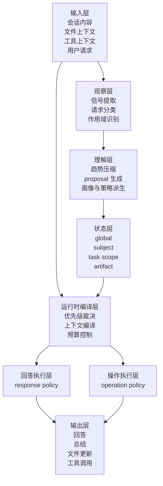
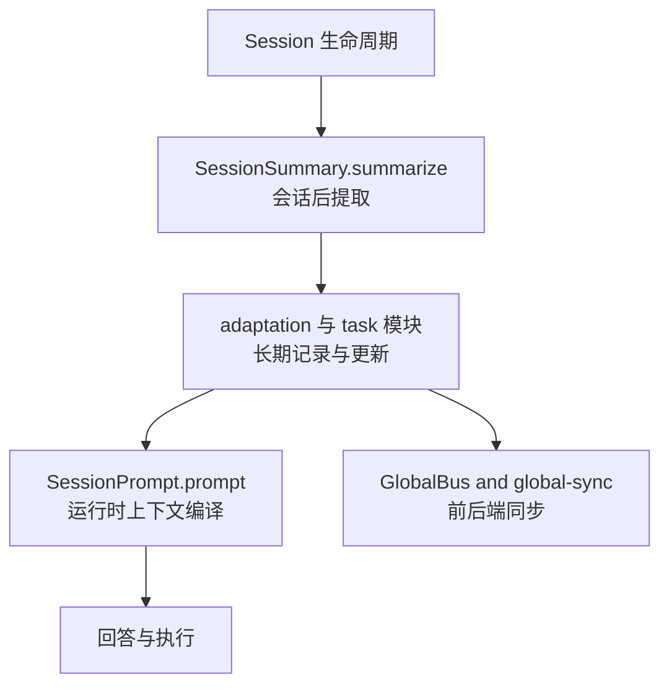
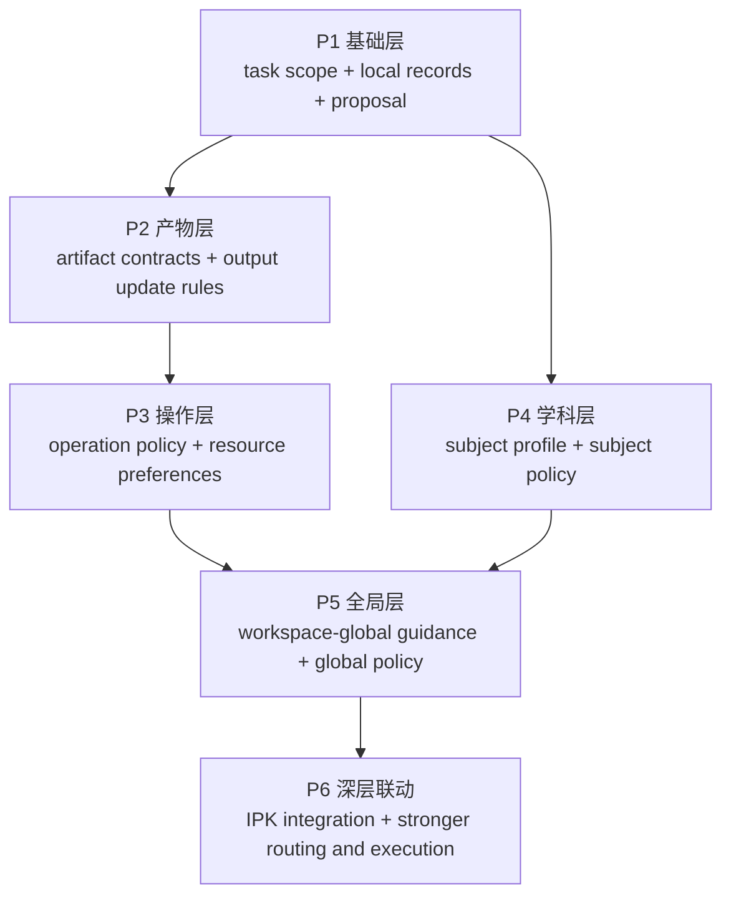

# 用户自适应系统总览

## 一句话定义

这个项目不是一层简单的“聊天记忆”或“偏好记录器”。

它是一套由 AI 自己维护、默认本地私有、分层作用域明确的长期上下文系统。  
它的目标是让 AI 不只知道“用户刚刚说了什么”，还逐渐知道：

- 这个用户通常怎样更容易被解释清楚
- 这个用户在不同学科或主题里已经会什么、习惯什么规范
- 这个用户在某个长期任务里当前做到哪里、形成了什么工作习惯
- 这个用户面对具体产物、工具、路径和操作时通常偏好怎样的工作流

然后把这种理解真正带入未来回答与执行。

## 阅读提示

如果第一次阅读本页时遇到下面这些词不太确定是什么意思：

- `signal`
- `summary`
- `proposal`
- `global_guidance`
- `subject_profile`
- `policy`
- `task_scope`
- `artifact_contract`
- `context_packet`

建议先配合阅读：

- [ipk-terms-glossary.zh-CN.md](/home/bzz/Aether/docs/IPK/ipk-terms-glossary.zh-CN.md)
  统一术语表

本页里最核心的几个词，可以先这样抓：

- `signal`
  单次会话中的局部证据。它不是长期结论，而是系统从当前 session 的用户消息里观察到的一个小事实，例如“用户不喜欢这种解释顺序”。assistant 文本最多只作为理解上下文的辅助，不作为 habit evidence。文件改动、工具操作和更广证据来源留到后续版本再评估。
- `summary`
  一段时间内对很多 `signals` 的阶段性压缩。它不是最终画像，而是系统为了看趋势，把零散证据先压成较稳定的中间描述。
- `proposal`
  高影响候选结论进入长期层前的缓冲层。也就是说，系统可以先提出“我怀疑这里形成了一个长期规律”，但不会立刻静默写死。
- `scope promotion`
  习惯从低层作用域提升到高层作用域的传递机制。例如某个 session 中观察到的记录习惯，经过证据累积后，被提议提升为 `task_scope`、`initiative`、`subject` 或 `global` 级规则；`workflow_profile` 若要引入，属于 vNext。
- `profile`
  系统对用户、学科或任务的长期理解。它不是原始记录堆，而是已经较稳定的、可在未来反复使用的理解层。
- `policy`
  基于长期理解导出的未来回答或执行策略。换句话说，`profile` 回答“系统知道了什么”，`policy` 回答“因此之后该怎么做”。
- `context_packet`
  运行时真正送入模型的小而准上下文包。它不是整个长期记录原样塞给模型，而是把最相关、最该生效的部分压缩后再送入运行时。

## 这套系统要解决什么问题

现代 AI 常见的问题并不是“没有知识”，而是“不了解这个具体的人和这个具体任务”。

这会导致几类系统性问题：

- 解释层失配
  AI 讲得太浅、太重、太跳，或者用了用户不熟的规范与记号。

- 知识坐标失配
  AI 不知道用户在某一主题上已经掌握到哪里，也不知道该从哪个已知 anchor 切入。

- 任务连续性失配
  AI 不知道一个长期任务已经做过什么、决定过什么、还缺什么。

- 产物生成失配
  AI 不知道某类目标产物应如何组织、写到哪里、哪些相关文件需要一起更新。

- 工作流与操作失配
  AI 不知道用户面对同类工具、目录、程序、流程时通常怎样选择、怎样排序、怎样执行。

这也是为什么这套系统的目标不是“让 AI 更会聊天”，而是“让 AI 更像一个真正持续理解用户与任务的长期助手”。

## 核心原则

### 1. 用户决定习惯边界，AI 负责底层组织

用户自适应系统和 IPK 内容库的人机分工不同。

IPK 内容库中，用户主要关心物理内容、材料和知识片段，AI 负责底层索引、map、检索和连接。  
用户自适应系统中，用户对自己的习惯、偏好和适用范围最了解，因此用户应拥有更强的审核、选择、提升、降级、禁用和纠正权。

原则是：

> 用户决定哪些习惯值得固定、适合在哪里生效、何时提升或收窄。  
> AI 负责理解候选习惯、维护结构化习惯库、构建索引和关系、在运行时匹配并引用。

用户不应该被迫维护：

- schema
  也就是长期记录对象的字段结构和更新约束。
- 索引结构
  也就是不同层记录以后怎样被查找和组合。
- 检索策略
  也就是运行时先读哪层记录、后读哪层记录、如何控制范围。
- prompt 组合方式
  也就是长期理解最终怎样被放进模型上下文。
- 工具路由细节
  也就是遇到不同任务时优先调用什么工具、资源和路径。

但用户应能方便地管理：

- 当前 Session 习惯。
- 习惯审查中建议作用域与用户最终选择的作用范围。
- project / global 参考习惯是否应继续被引用。
- 某条习惯是否应提升、降级、禁用或改写。

### 2. 系统必须分层，而不是只有一张扁平画像

真正会影响回答和执行的长期理解，并不只有一层“用户偏好”。

当前最推荐的作用域划分是：

- `global`
  习惯库里跨任务成立的长期规则与偏好真源，也就是无论做什么任务都大致成立、可被 session 引用的 confirmed 习惯。

- `subject`
  只在某个学科或主题里成立的知识坐标与规范偏好，也就是进入某个领域后才会生效的理解。

- `initiative`
  在一个真实长期事项、研究项目或工作目标中跨多个任务成立的背景、约束和默认工作规则；v1 下它与 Aether 工作区 project **完全解绑**，新习惯的 initiative 归属由路由 classifier 决定（详见 [docs/decisions/project-initiative-decoupling-and-routing.md](../../decisions/project-initiative-decoupling-and-routing.md)）。

- `task_scope`
  某个长期逻辑任务的状态、约束、工作流习惯与资源偏好，也就是“这个具体任务现在进行到哪里、通常怎么做”的那一层。

- `artifact`
  某个具体输出目标的格式、写入规则与更新关系，也就是“这类产物应当写成什么样、写到哪里、是否要联动更新”的规则层。

- `session`
  当前这次对话中的临时要求，也就是只在这一轮或这一小段互动里成立的短期约束。

也就是说，这套系统不是维护一张扁平“用户画像”，而是在维护一个独立习惯库。`global / subject / initiative / task_scope / artifact` 是平行 scope 标签，不是树状归属关系；它们标记一条习惯适合在哪些范围被使用。真正运行时生效的是当前 session 的 `imported active habits + scratch active habits`，而不是只看 `habit_ids`。

这意味着：

- 有些理解跨任务长期成立
- 有些理解只在某个学科里成立
- 有些理解只在某个项目里成立
- 有些理解只在某个任务里成立
- 有些理解只对当前输出对象成立
- 有些理解只在当前会话暂时成立
- 但任何高层习惯都不因层级高而自动进入每个 session，必须经过匹配或用户确认后被引用。

### 3. 高影响理解不能直接静默生效

单次会话可以提供证据，但不应该直接改写长期理解。

所以系统采用慢更新链路：

```text
会话证据
  -> signals
  -> summaries
  -> promotion candidates
  -> proposals
  -> confirmed records
  -> runtime context
```

这条链可以这样理解：

- `signals`
  是局部观察，还不是长期结论。
- `summaries`
  是阶段压缩，用来判断最近是否出现了稳定趋势。
- `proposals`
  是高影响候选结论，先进入待确认层，而不是直接生效。
- `promotion candidates`
  是系统判断“这条局部习惯可能应该作用于更大范围”时形成的候选提升。
- `confirmed records`
  是已经足够稳定、允许进入长期层的正式记录。
- `runtime context`
  是运行时真正送入模型的压缩上下文，而不是把所有长期记录原样塞进去。

其中 `proposal` 的作用是：

- 承接高影响候选结论
- 把“AI 自动提炼”和“正式进入长期层”之间加一层确认缓冲
- 合并同类候选结论，避免多次重复确认
- 放入待处理队列，让用户统一审阅，而不是一出现就打断工作

### 4. 这套系统同时决定“怎么说”和“怎么做”

它最终产出的不只是回答风格策略，还包括动作策略。

也就是说，它至少要同时生成两类结果：

- `response policy`
  决定怎么解释、从哪里开始、用什么严谨度、怎样桥接陌生形式主义。它对应的是“怎么说更合适”。

- `operation policy`
  决定怎么执行、先做什么、该更新哪些记录文件、优先调用什么资源、怎样操作这些资源。它对应的是“怎么做更合适”。

所以它不是简单的“更会记住用户”，而是“更会根据长期理解组织回答与执行”。

## 它最终应该带来什么能力

如果这套系统工作得足够好，它最终应该稳定支持下面这些能力：

### 1. 回答自适应

当用户问一个问题时，系统不只看问题文本，还会综合：

- 已有知识 anchor
  也就是用户已经掌握、可以拿来当解释起点的知识点或表达体系
- 规范与记号偏好
- 学科内的脆弱区与熟练区
- 当前任务的目标和语境

从而决定：

- 从哪里开始讲
- 应该讲到多深
- 应不应该先桥接到熟悉语言

### 2. 长期任务连续性

当用户在一个长期任务中反复工作时，系统会尽量保留：

- 任务目标
- 当前状态
- 已完成工作
- 已确认决策
- 未解决问题
- 该任务中形成的局部工作习惯

从而避免 AI 每次都把任务当成“全新上下文”。

### 3. 结构化产物生成

当用户要求“总结并记录”“整理成文档”“更新产物”时，系统会尽量知道：

- 这类产物应该采用什么格式
- 应写入哪个目标
- 哪些目标文件属于同一组输出
- 更新一个产物时是否需要联动更新相关产物

这里的“产物”不是某一个具体例子，而是一类目标对象，例如：

- 笔记
- 报告
- 论文草稿
- 附件材料
- 成对或成组维护的记录文件

### 4. 工作流与操作自适应

当 AI 需要真正做事时，它会尽量知道：

- 用户通常偏好的工作顺序
- 哪些记录习惯和整理节奏在这个任务里成立
- 面对同类工具或资源时优先选哪一类
- 在什么情况下更倾向于用哪个目录、程序、`skill`（也就是预定义工作流方法）或流程

因此它适配的不只是“回答风格”，也包括“执行风格”。

## 关键对象

这套系统当前最重要的对象可以概括为：

- `signal`
  单次会话中的局部证据。它回答的是“这次互动里看到了什么事实或倾向”。

- `summary`
  一段时间内的趋势压缩。它把很多零散 `signals` 压缩成较稳定的阶段描述。

- `proposal`
  高影响候选结论，通常需要确认。它的意义是让系统先提出“我怀疑形成了一个长期规律”，但暂时不直接写死。

- `global_guidance`
  工作区 global 侧的轻量背景 + refs。它帮助 session 在 query time 先缩小候选范围，但不充当长期习惯正文真源。

- `subject_profile`
  学科或主题内的知识坐标。它保存用户在某个具体学科里已经会什么、习惯什么规范、哪些地方容易卡住。

- `policy`
  面向未来回答与执行的策略层。它不只是“知道了什么”，而是把长期理解转成未来真正会影响行为的规则。

- `task_scope`
  长期逻辑任务的状态和习惯层。它保存某个任务当前做到哪里、已经决定了什么、通常按什么顺序推进。

- `artifact_contract`
  具体产物的输出与更新规则。它保存一类产物应该长什么样、写到哪里、是否需要联动更新其他目标。

- `context_packet`
  运行时真正送入模型的小而准上下文包。它是长期理解经过筛选和压缩后的结果，而不是把全部长期记录原样塞给模型。

## 高层实现架构

这套系统现在已经不是只有“需求”和“理想效果”的初期想法。  
如果要把它讲成一个成熟方案，最关键的是把它看成几个明确协作的模块。



### 1. 输入层

它接收的不是只有聊天文本，还包括：

- 当前会话
- 当前 project / worktree / 打开文件
- 当前用户请求类型
- 当前工具和资源上下文

### 2. 观察层

这层负责把原始互动转成可用于长期更新的证据。

它至少包括：

- `signal extractor`：从对话、文件和操作中提取可复用的长期信号。
- `request classifier`：判断这次请求属于解释、执行、记录还是其他任务类型。
- `subject matcher`：识别当前问题更接近哪个学科或主题范围。
- `task scope matcher`：判断这次互动应该落到哪个长期任务作用域中。
- `artifact matcher`：识别当前请求关联的是哪个具体产物或目标文件。

### 3. 理解层

这层负责把局部证据慢慢变成长期理解。

它至少包括：

- `summary builder`：把一段时间内的零散证据压缩成稳定趋势摘要。
- `proposal manager`：管理高影响候选结论，并把它们送入确认流程。
- `proposal manager` 还应负责合并同类 proposal、去重、维护 pending 队列和统一审阅入口。
- `profile updater`：在证据足够稳定时更新长期画像记录。
- `policy derivation`：根据长期理解派生出面向回答与执行的策略。

### 4. 状态层

这层是本地长期记录的核心。

它至少包括：

- `workspace-global guidance store`：保存工作区 global 侧的轻量背景 + refs，给 session 提供跨项目、跨任务的缩圈参考。
- `subject profile store`：保存学科内部的知识坐标与规范偏好。
- `task scope store`：保存某个长期任务的状态、习惯、约束与资源偏好。
- `artifact contract store`：保存具体产物的格式要求、写入规则与更新关系。

### 5. 运行时编译层

真正会直接影响模型行为的不是单个 profile，而是这层。

它至少负责：

- 多层记录读取
  也就是同时读取 `global`、`subject`、`task_scope`、`artifact`、`session` 这些不同层的信息。
- 优先级覆盖
  也就是决定当前到底哪一层更应该生效，谁覆盖谁。
- token 预算控制
  也就是控制送进模型的上下文长度，不让长期记录把运行时上下文挤爆。
- 编译成短上下文包
  也就是最终生成一个小而准的 `context_packet`。

### 6. 回答执行层

这层负责组织：

- 解释顺序
- 深度
- 严谨度
- 规范桥接方式

### 7. 操作执行层

这层负责组织：

- 工作顺序
- 文件更新策略
- 工具 / 路径 / 程序选择
- 资源调用方式

## 在 Aether 中的落点

从当前 Aether 结构出发，这套系统最合理的高层落点是：



对应到工程模块，当前最重要的模块是：

- `adaptation/`：负责 signals、summaries、proposals、profiles 和 policies 的主链路。
- `task-scope/`：负责长期逻辑任务对象、任务绑定和作用域更新，也就是维护“这个任务自己的长期状态层”。
- `artifact/`：负责产物合同、写入规则和多文件联动更新关系，也就是维护“这类输出对象该怎样写”的规则层。
- `context/`：负责运行时上下文编译、优先级合并和预算控制，也就是把长期理解压成运行时可用的小上下文包。

这也是为什么这套系统不能简单塞进现有 `knowledge` 或现有 `workspace` 里打补丁。

## 和 IPK 内容系统的关系

这套系统和 IPK 内容系统长期协作，但边界必须清楚。

### IPK 负责：

- 有哪些内容
- 内容之间怎样关联
- 怎样查找与验证内容

### 自适应系统负责：

- 应该怎样理解用户
- 应该怎样理解当前任务
- 应该怎样组织回答与执行

所以它们的关系可以概括成：

- IPK 提供“可被使用的长期内容”
- adaptation 提供“怎样更合适地使用这些内容”，也就是在运行时决定更适合怎样解释、怎样执行、怎样调用资源。

## 本地优先与隐私

这套系统涉及大量敏感信息：

- 长期风格
- 知识短板
- 工作习惯
- 项目进展
- 文件约束
- 资源使用偏好

因此当前设计明确倾向：

- 本地优先
- 不默认上云
- global 真源记录放在独立 memory root 的 `global/` 分区
- subject 真源记录放在独立 memory root 的 `subjects/` 分区
- project 引用层记录放在独立 memory root 的 `projects/` 分区
- task_scope / artifact 真源记录分别放在独立 memory root 的 `task-scopes/` 和 `artifacts/` 分区
- 第一版不默认把长期 adaptation 真源写入项目目录

同时系统会维持两种视图：

- 机器可稳定读写的结构化记录
- 人可审阅与确认的摘要视图

## 建议的实现顺序

这套系统已经是一个相当完备的方案，但它仍然不适合一口气全做完。  
最稳妥的方式，是按依赖关系先做高价值骨架，再逐层增强。



### Phase 1

- `task_scope`：先把长期任务边界、任务绑定和局部习惯沉淀下来。
- 本地记录：先把关键长期信息稳定保存在本地私有目录中。
- `proposal` 确认流：先把高影响理解做成可审阅、可确认、可回退的流程。
- 同类 `proposal` 合并与 pending 队列：避免 proposal 一出现就打断用户或直接写入。

先把长期任务边界和高影响确认流做稳。

### Phase 2

- `artifact_contract`：先把具体产物的格式、插入位置和更新约束建起来。
- 产物更新规则：先定义系统在什么情况下应该改哪些记录或输出文件。
- 基础 summarize-and-record 流：先打通“总结后直接落盘”的最小闭环。

先把“结构化输出”打通。

### Phase 3

- `operation_policy`：开始让系统学会按用户习惯组织动作顺序。
- 资源偏好：开始让系统知道在什么情形下优先调用什么资源。
- 工具与路径选择：开始让系统按用户的一贯方式选择程序、目录和入口。

开始让系统的执行越来越像用户自己的工作方式。

### Phase 4

- `subject_profile`：为不同学科建立各自独立的知识坐标层。
- 学科级知识坐标：让系统知道用户在这个领域已经会什么、缺什么。
- 规范与记号对齐：让系统尽量沿用户熟悉的表述体系和记号工作。

解决“怎么讲更合适”的学科层问题。

### Phase 5

- `global_guidance`：整理跨项目、跨任务稳定成立的轻量背景 + refs，给 session 提供缩圈参考。
- 更完整的 policy：把回答策略与操作策略扩展成更完整的运行规则。
- 温和纠偏逻辑：在适应用户的同时保留适度提醒和引导能力。

### Phase 6

- 与 IPK 的深层联动：让长期内容系统和长期理解系统真正协同起来。
- 更复杂的 runtime routing：让不同层记录能在运行时更精准地被选中。
- 更强的回答与执行闭环：让理解、回答、操作、记录形成持续反馈回路。

## 总结

如果要用一句最适合对外展示的话来概括它，我会这样说：

> 我们在做的不是一层简单的偏好记录。  
> 我们在做的是一套由 AI 自己维护、默认本地私有、分层作用域明确的长期上下文系统。  
> 它会逐渐理解用户、学科、任务、产物与工作方式，并把这种理解真正编译进未来回答与执行。
